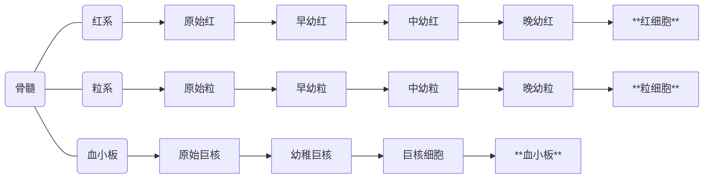
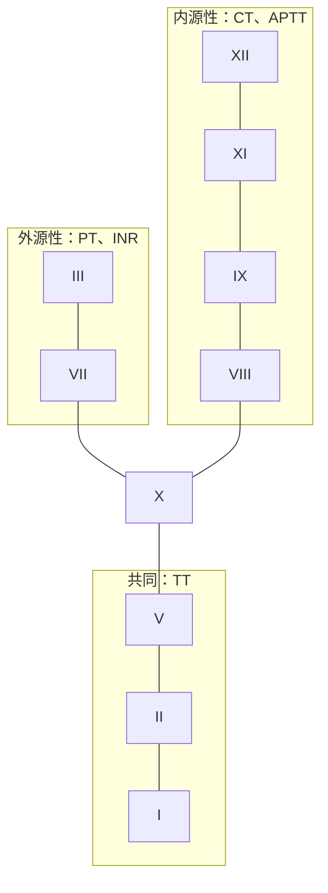
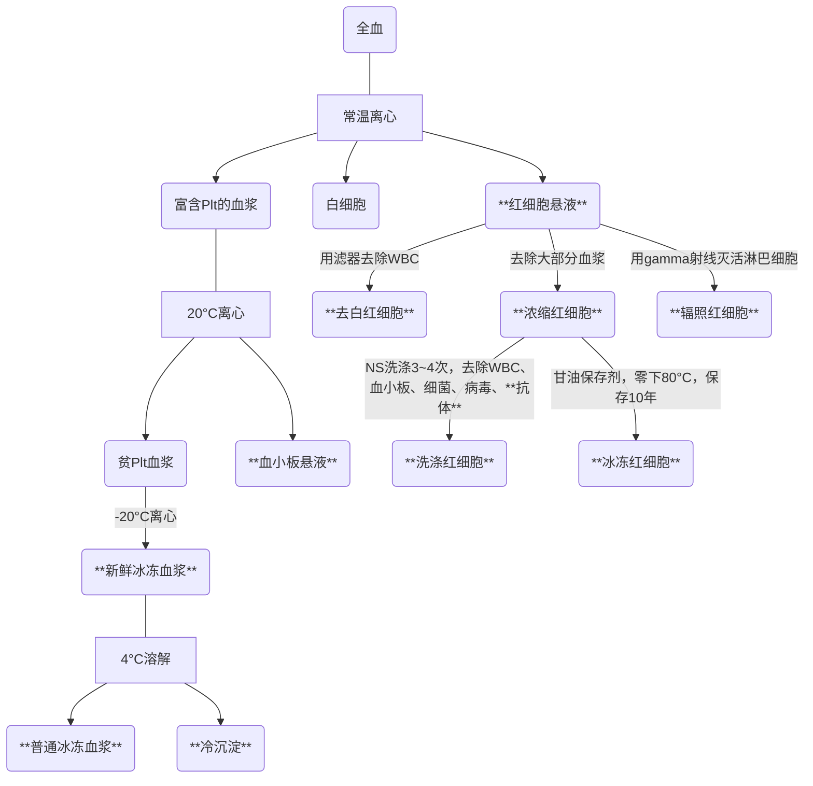

# 第一天

## 血细胞的形成

## 常考血液病实验室检查的鉴别

<table>
    <tr>
        <th></th>
        <th></th>
        <th>缺铁贫</th>
        <th>巨幼贫</th>
        <th>再障贫</th>
        <th>MDS</th>
        <th>急白</th>
        <th>ITP</th>
    </tr>
    <tr>
        <td rowspan="3"><strong>血象</strong></td>
        <td><strong>RBC</strong></td>
        <td>⇩</td>
        <td>⇩</td>
        <td>⇩</td>
        <td>⇩</td>
        <td>⇩</td>
        <td>N</td>
    </tr>
    <tr>
        <td><strong>WBC</strong></td>
        <td>N</td>
        <td>N</td>
        <td>⇩</td>
        <td>⇩</td>
        <td>↑</td>
        <td>N</td>
    </tr>
    <tr>
        <td><strong>Plt</strong></td>
        <td>N</td>
        <td>N</td>
        <td>⇩</td>
        <td>⇩</td>
        <td>⇩</td>
        <td>⇩</td>
    </tr>
    <tr>
        <td rowspan="5"><strong>骨髓</strong></td>
        <td><strong>红系</strong></td>
        <td>↑</td>
        <td>↑</td>
        <td>⇩</td>
        <td>↑</td>
        <td>⇩</td>
        <td>N</td>
    </tr>
    <tr>
        <td><strong>粒系</strong></td>
        <td>N</td>
        <td>N</td>
        <td>⇩</td>
        <td>↑</td>
        <td>⇩</td>
        <td>N</td>
    </tr>
    <tr>
        <td><strong>巨核</strong></td>
        <td>N</td>
        <td>N</td>
        <td>⇩</td>
        <td>↑</td>
        <td>⇩</td>
        <td>↑</td>
    </tr>
    <tr>
        <td><strong>增生</strong></td>
        <td>红系活跃</td>
        <td>红系活跃</td>
        <td><strong>增生不良</strong></td>
        <td>增生活跃</td>
        <td>增生活跃</td>
        <td>巨核活跃</td>
    </tr>
    <tr>
        <td><strong>原始</strong></td>
        <td>小于30%</td>
        <td>小于30%</td>
        <td>小于30%</td>
        <td>小于30%</td>
        <td><strong>大于30%</strong></td>
        <td>小于30%</td>
    </tr>
</table>

## 急性白血病重要考点分类

分型|名称|实验室检查
--|--|--
**M3**|**急性早幼粒**|骨髓中以早幼粒细胞为主，早幼粒在NEC中**大于等于30%**，使用**全反式维A酸**治疗
**M4**|**急粒-单白血病**|各阶段粒细胞**大于等于20%**，各阶段单核细胞**大于等于20%**
**M5**|**急单白血病**|骨髓NEC中原单+幼单+单核细胞**大于等于80%**

## （非/）霍奇金淋巴瘤化疗方案

肿瘤类型|首选|次选
--|--|--
霍奇金淋巴瘤|ABVD|MOPP
非霍奇金淋巴瘤（**侵袭性**）|CHOP|EPOCH
非霍奇金淋巴瘤（**惰性/非侵袭性**）|COP|N/A

## 凝血因子与凝血五项

- 外源性
  - **I**NR凝血酶原时间国际标准化比值（2.0~2.5）
  - **T**T凝血酶时间（16~18s）
  - **P**T凝血酶原时间（11~13s）
- 内源性
  - **C**T凝血时间（4~12min）
  - **A**PTT活化部分凝血活酶时间（31~43s）
  - **T**T凝血酶时间（16~18s）

血友病甲：凝血因子**VIII**异常  
血友病乙：凝血因子**IX**异常

维生素K依赖的凝血因子：II、VII、IX、X

## 输血指征

血色素|决策
--|--
**HB>100g/L**|不输血
**HB<70g/L**|浓缩红
**HB70~100g/L**|依照具体情况，尽量不输

## 成分血液制备

