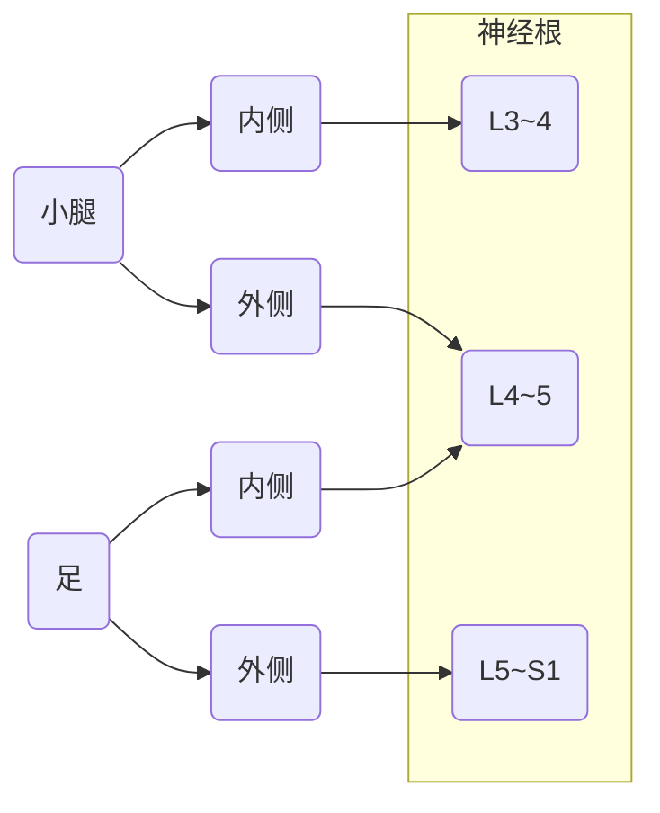
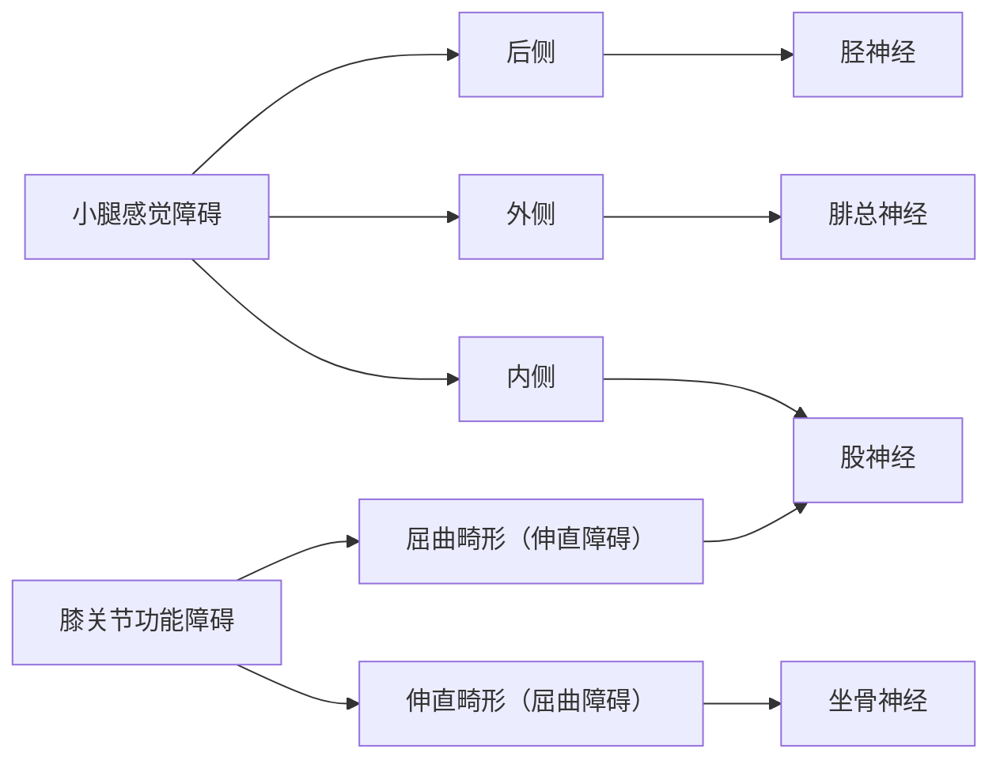

# 第三天

## 腰椎神经根支配区域

## 常见关节脱位

肩关节易发生前脱位，髋关节易发生**后脱位**，造成**坐骨神经**损伤。

> 前肩后髋

### 髋关节脱位

> 前外外，后内内

髋关节中心脱位：出血性休克、大血肿、内脏损伤

## 清创

清创原则

- 神经、肌腱争取一期修复
- 非重要血管可结扎处理
- 主干血管应一期缝合

## 颈椎病

分型|原因|临床表现|治疗
--|--|--|--
脊髓型|髓核后正中突出|颈痛不明显；四肢乏力，行走、**持物不稳**为最初症状，伴有**走路踩棉花感**；自下而上的上运动神经元性瘫痪|**禁用**颌枕带牵引；禁用推拿按摩理疗；药物治疗；手术治疗
神经根型（50~60%，最常见）|髓核侧后方突出|向上肢放射的颈肩痛；感觉异常、肌力下降；神经受压指征；**压头试验**、**上肢牵拉试验**阳性|颌枕带牵引；推拿按摩理疗；药物治疗；无效则手术
交感神经型|颈椎各种病变的刺激|一系列交感神经兴奋或抑制的症状和体征，可有感官异常但不会猝倒|同上
椎动脉型|椎动脉受刺激或压迫|脑供血不足的症状和体征，可有感官异常和**猝倒、晕厥**|同上

## 骨折与易损伤结构

股骨干下1/3骨折——损伤腘窝结构中的**腘动脉**

肱骨干下1/3骨折——损伤腋窝结构中的**正中神经**、**肱动脉**。

髋关节后脱位损伤**坐骨神经**

## 狭窄性腱鞘炎

1. 弹响指
1. 芬氏试验（握拳尺偏试验）：桡骨茎突狭窄性腱鞘炎

## 下肢神经损伤

## 关节脱位体征

1. 弹性固定
1. 畸形
1. 空虚感

## 冷脓肿

结核造成的脓肿，与一般化脓性感染不同，也有疼痛肿胀功能障碍，但没有红、热等现象，是脊柱结核的常见并发症。

诊断：CT

治疗：积极治疗原发病，穿刺是绝对禁忌证！因为会造成瘘。

## 小腿骨折并发症

1. 上1/3：缺血性坏死
1. 中1/3：骨筋膜室综合征
1. 下1/3：延迟愈合

## 前臂双骨折

本质是一根骨折，另一根脱位

- 孟氏：上1/3，尺骨骨折，桡骨头脱位
- 盖氏：下1/3，桡骨骨折，尺骨小头脱位

治疗时**先治疗脱位**，原则为优先治疗简单的、稳定的、相对较粗的。

上2/3尺骨粗，下1/3桡骨粗。
