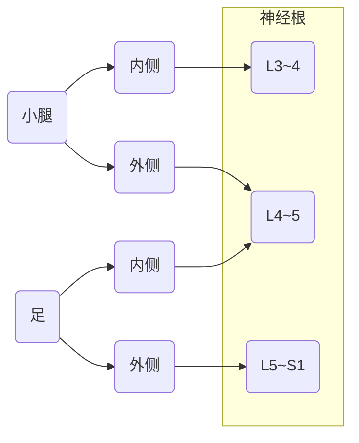

# 第三天

## 腰椎神经根支配区域

## 常见关节脱位

肩关节易发生前脱位，髋关节易发生**后脱位**，造成**坐骨神经**损伤。

> 前肩后髋

### 髋关节脱位

> 前外外，后内内

髋关节中心脱位：出血性休克、大血肿、内脏损伤

## 清创

清创原则

- 神经、肌腱争取一期修复
- 非重要血管可结扎处理
- 主干血管应一期缝合

## 颈椎病

分型|原因|临床表现|治疗
--|--|--|--
脊髓型|髓核后正中突出|颈痛不明显；四肢乏力，行走、持物不稳为最初症状；自下而上的上运动神经元性瘫痪|
神经根型|髓核侧后方突出|
椎动脉型|椎动脉受刺激或压迫|
交感神经型|颈椎各种病变的刺激|