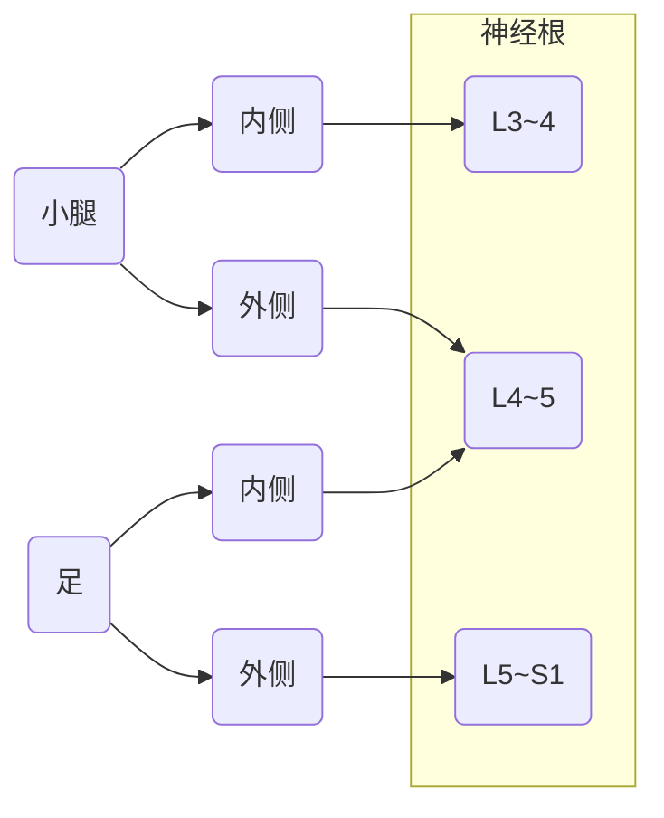

# 第三天

## 腰椎神经根支配区域

```mermaid
graph LR
A(小腿) --> A1(内侧) & A2(外侧)
B(足) --> B1(内侧) & B2(外侧)
subgraph 神经根
    C1(L3~4)
    C2(L4~5)
    C3(L5~S1)
end
A1 --> C1(L3~4)
A2 & B1 --> C2(L4~5)
B2 --> C3(L5~S1)
```

<rowspan=3>
