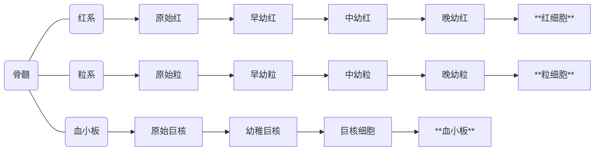
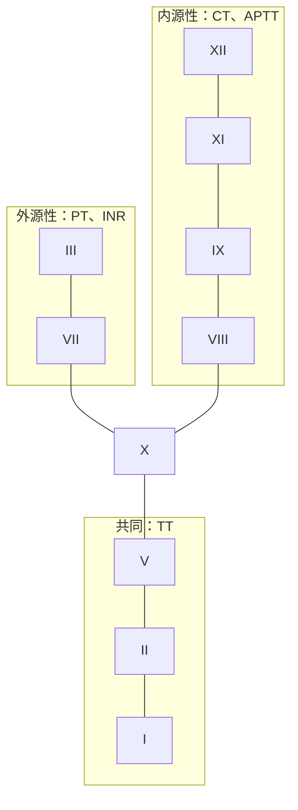
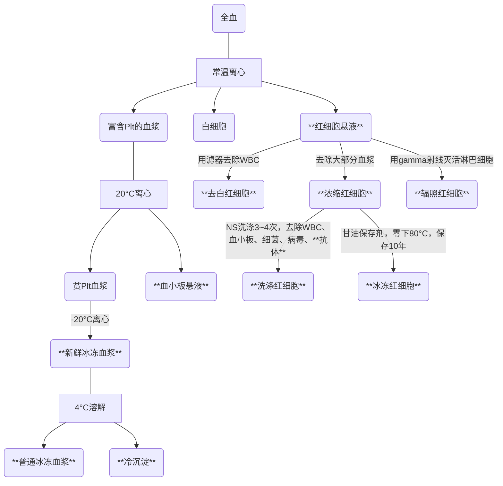

# 血液系统

## 血细胞的形成

## 常考血液病实验室检查的鉴别

<table>
    <tr>
        <th></th>
        <th></th>
        <th>缺铁贫</th>
        <th>巨幼贫</th>
        <th>再障贫</th>
        <th>MDS</th>
        <th>急白</th>
        <th>ITP</th>
    </tr>
    <tr>
        <td rowspan="3"><strong>血象</strong></td>
        <td><strong>RBC</strong></td>
        <td>⇩</td>
        <td>⇩</td>
        <td>⇩</td>
        <td>⇩</td>
        <td>⇩</td>
        <td>N</td>
    </tr>
    <tr>
        <td><strong>WBC</strong></td>
        <td>N</td>
        <td>N</td>
        <td>⇩</td>
        <td>⇩</td>
        <td>↑</td>
        <td>N</td>
    </tr>
    <tr>
        <td><strong>Plt</strong></td>
        <td>N</td>
        <td>N</td>
        <td>⇩</td>
        <td>⇩</td>
        <td>⇩</td>
        <td>⇩</td>
    </tr>
    <tr>
        <td rowspan="5"><strong>骨髓</strong></td>
        <td><strong>红系</strong></td>
        <td>↑</td>
        <td>↑</td>
        <td>⇩</td>
        <td>↑</td>
        <td>⇩</td>
        <td>N</td>
    </tr>
    <tr>
        <td><strong>粒系</strong></td>
        <td>N</td>
        <td>N</td>
        <td>⇩</td>
        <td>↑</td>
        <td>⇩</td>
        <td>N</td>
    </tr>
    <tr>
        <td><strong>巨核</strong></td>
        <td>N</td>
        <td>N</td>
        <td>⇩</td>
        <td>↑</td>
        <td>⇩</td>
        <td>↑</td>
    </tr>
    <tr>
        <td><strong>增生</strong></td>
        <td>红系活跃</td>
        <td>红系活跃</td>
        <td><strong>增生不良</strong></td>
        <td>增生活跃</td>
        <td>增生活跃</td>
        <td>巨核活跃</td>
    </tr>
    <tr>
        <td><strong>原始</strong></td>
        <td>小于30%</td>
        <td>小于30%</td>
        <td>小于30%</td>
        <td>小于30%</td>
        <td><strong>大于30%</strong></td>
        <td>小于30%</td>
    </tr>
</table>

## 急性白血病重要考点分类

分型|名称|实验室检查
--|--|--
**M3**|**急性早幼粒**|骨髓中以早幼粒细胞为主，早幼粒在NEC中**大于等于30%**，使用**全反式维A酸**治疗
**M4**|**急粒-单白血病**|各阶段粒细胞**大于等于20%**，各阶段单核细胞**大于等于20%**
**M5**|**急单白血病**|骨髓NEC中原单+幼单+单核细胞**大于等于80%**

## 凝血因子与凝血五项

- 外源性
  - **I**NR凝血酶原时间国际标准化比值（2.0~2.5）
  - **T**T凝血酶时间（16~18s）
  - **P**T凝血酶原时间（11~13s）
- 内源性
  - **C**T凝血时间（4~12min）
  - **A**PTT活化部分凝血活酶时间（31~43s）
  - **T**T凝血酶时间（16~18s）

血友病甲：凝血因子**VIII**异常
血友病乙：凝血因子**IX**异常

维生素K依赖的凝血因子：II、VII、IX、X

## 输血指征

血色素|决策
--|--
**HB>100g/L**|不输血
**HB<70g/L**|浓缩红
**HB70~100g/L**|依照具体情况，尽量不输

## 成分血液制备

## 影响氧离曲线的因素

- 曲线左移：PH↑、DPG↓、温度↓、PCO2↓
- 曲线右移：PH↓、DPG↑、温度↑、PCO2↑

> 左迁降职到盐碱地（偏碱性，其余指标皆下降）

## 恶性贫血

属于**巨幼红细胞性贫血**，
见于**A型**萎缩性胃炎，常见部位是胃体，
**抗壁细胞抗体**与**抗内因子阳性**

## 鉴别贫血

- 大巨肝异常：大细胞性贫血，红细胞平均体积（MCV）大于100飞升 (fL）。
    - 巨幼细胞性贫血
    - 骨髓增生异常综合征
    - 肝疾病。
- 小铁慢海洋：小细胞低色素性贫血，MCV小于80fL，红细胞平均血红蛋白浓度（MCHC）降低。
    - 缺铁性贫血
    - 铁粒幼细胞性贫血
    - 慢性病贫血
    - 海洋性贫血（珠蛋白生成障碍性贫血）
- 急溶再正常：正常细胞性贫血，MCV在80-100fL之间。
    - 急性失血性贫血
    - 溶血性贫血
    - 再生障碍性贫血
    - 骨髓病性贫血

巨幼贫——核幼浆老：中央淡染区消失（Vit-B12是合成细胞核的，细胞核出问题）
缺铁贫——核老浆幼：中央淡染区扩大（铁是合成血红蛋白的，细胞浆出问题）

> 什么缺少了，什么就幼稚

**缺铁贫**同时会有组织缺铁，造成**匙状甲**

慢性病贫血及肾病贫血采用**EPO治疗**

## 巨幼贫

症状：

- 神经系统：会发生亚急性脊髓联合变性，因维生素B12、叶酸缺乏所致，脊髓后索损害，表现为深感觉障碍，共济失调，走路不稳
- 消化系统：舌乳头萎缩，导致镜面舌或牛肉舌

VitB₁₂缺乏最常见的原因是**吸收障碍**，
可见于内因子缺乏，如恶性贫血、胃切除、胃黏膜萎缩等

基本不会摄入不足，如果吸收正常，连续10～15年不吃肉才会导致缺乏

素食主义者/长期素食易致

治疗优先补**叶酸**，只有出现**神经系统症状时**才补b12

## 再障贫

- 网织红小于**15**
- 中性粒小于**0.5**
- 血小板小于**20**

需要**多部位穿刺**，**骨髓细胞学检查**确诊，
不是骨髓活检！执业不考骨髓活检！

三系减少，胸骨后**无压痛**，骨髓增生低下，**未见**巨核细胞

## 骨髓增生异常综合征MDS

骨髓细胞学改变：粒细胞，红细胞，巨核单系、多系呈
病态造血

骨髓细胞学检查中典型的病态造血表现主要是
粒系细胞**核分叶减少**，**胞体增大**

三系减少，但**可见**幼稚细胞，网织红百分数在0.005以下

判断分型：

- WHO分型是细胞学和活检
- FAB分型是细胞学和铁染色

## 溶贫

**coombs试验**（抗人球蛋白试验）阳性，
提示**温抗体型自免性溶贫**

阵发性睡眠性血红蛋白尿**PNH**：
特点是晨起或夜间有血红蛋白尿，
诊断首选：**CD55、59**(流式细胞术，血粒细胞FLAER检测)，
次选：**酸溶血试验**(Ham)

## 粒细胞缺乏

粒细胞减少＜1.5
粒细胞缺乏＜0.5

## 用药

- EPO（促红细胞生成素）➡升红
- TPO（促血小板生成素）➡升板
- G-CSF（粒细胞集落刺激因子）➡升白
- GM-CSF（粒细胞-巨噬细胞集落刺激因子）➡升白+板

## 贫血的治疗

- 硫酸亚铁➠缺铁贫
- 维生素B₁₂及叶酸➠巨幼细胞性贫血
- 维生素K ➠PT延长的外源性凝血障碍
- EPO➠肾性贫血

## 铁的使用顺序

1. 先花存款（储存铁）——铁蛋白下降
1. 再花流动资金（血清铁）——血清铁下降
1. 没有钱了只能砸锅卖铁（细胞里的铁）
1. 破产了卖掉公司（组织铁）

## 补铁恢复时间

1. 首先升高Ret（网织红）
1. 2周Hb开始升高
1. 2月Hb恢复正常
1. 继续补4～6个月，待铁蛋白正常后停药

## 补铁方式

只有口服铁剂**不能耐受**时，
或胃肠道正常解剖部位发生改变而影响铁的吸收，
才可用**铁剂肌内注射**

## DIC时PF4升高

血小板因子4是由血小板α颗粒释放的一种蛋白质，
当血小板被激活时，PF4会被释放到血浆中。
在DIC的病理过程中，
由于微血栓的形成和凝血酶的激活，
血小板会被大量激活，导致PF4的释放增加。
因此，PF4的水平可以作为反映血小板活化和DIC进程的一个指标。

## 白血病

- AML     急性髓细胞白血病
- CML     慢性髓细胞白血病（慢性粒细胞白血病）
- ALL     急性淋巴细胞白血病
- CLL     慢性淋巴细胞白血病
- (N)HL   （非）霍奇金淋巴瘤

Acute 急性
Chronic 慢性
Lymph 淋巴
Myeloid 髓系
Leukemia 白血病

### AML的FAB亚型

- M1：急粒未分化型：原始粒细胞＞90%
- M2：急粒部分分化型：原始粒细胞30-89%
- **M3**：急性早幼粒细胞白血病：早幼粒＞30%
- M4：急性粒-单核细胞白血病：原粒＞20%，原单＞20%
- **M5**：急性单核细胞白血病，原单核、幼单核＞30%，
- M6：红白血病：幼红＞50%
- M7：急性巨核细胞白血病，原始巨核细胞＞30%

### 临床症状

- **CML**：**巨脾** + 血象见各阶段粒细胞
- AML：过氧化物酶（POX）、髓过氧化物酶（MPO）阳性
    - **M3急性早幼粒**：胞质有成堆棒状小体，MPO强阳性，cd13-33-117阳性
    - M2急性粒细胞白血病部分分化型：粒细胞肉瘤（眼球突出（绿色瘤），真性肿瘤）
    - M5：非特异酯酶（NSE）阳性，MPO阳性
    - M4、M5：牙龈增生（不是出血）
- ALL：糖原染色（PAS）阳性

M5急单可被**氟化钠**（NaF）抑制

并发症：
ALL：睾丸浸润（睾丸白血病）
M3：DIC

化疗方案：
- AML
    - 非M3：DA/IA
    - M3：全反式维甲酸
- ALL：VDP
- HL：ABVD
- NHL：CHOP

两个特殊类型对比：
1. M3:急性早幼粒细胞白血病
    - 染色体异常：t（15，17）
    - 形成：PML—RARA融合基因
    - 治疗：全反式维甲酸
2. CML:慢性粒细胞白血病（突出表现巨脾）
    - 染色体异常：t（9，22）费城染色体
    - 形成：BCR—ABL融合基因
    - 治疗：首选伊马替尼等TKI，羟基脲和别嘌醇可用于高白细胞计数或白细胞淤滞

## 碱性磷酸酶（NAP）

见于成熟阶段的中性粒细胞，其他细胞均呈阴性反应。
**CML**因中性粒细胞成熟障碍，
因此碱性磷酸酶活性低。

NAP下降见于：

- 急粒
- 慢粒
- SLE（女性多见）
- PNH（阵发性睡眠性血红蛋白尿）（睡）
- 病毒感染

> 口诀：莉莉睡病毒

## 淋巴瘤

诊断：

弥漫性大B细胞淋巴瘤：年轻男性，CD20
套细胞淋巴瘤：老年男性，CD5、CD20
间变性大细胞淋巴瘤：儿童，CD30
霍奇金淋巴瘤：CD15、CD20、CD30

镜影细胞（R-S细胞）主要见于**霍奇金淋巴瘤**
爆米花样细胞：结节淋巴型
陷窝细胞：结节硬化型

治疗：

霍奇金淋巴瘤：100%B细胞来源+**ABVD**方案
非霍奇金淋巴瘤：80%-90%B细胞来源+10%-20%T细胞来源（蕈样肉芽肿/Sezary综合征+间变大细胞淋巴瘤）+ **CHOP**方案

胃部最常见的是**边缘区淋巴瘤**，
边缘区淋巴瘤常见于胃底

### AnnArborl临床分期标准

- I：（肿大淋巴结分布在膈肌）单侧一个
- II：单侧两个
- III：膈肌上下
- IV：肝肺骨髓、胸水检出瘤细胞

附加字母：

- A：无症状
- B：有症状
- E：累及淋巴结外器官
- S：累及脾脏

## 多发性骨髓瘤

主要症状：**贫血**，常有**骨骼损害**，
引起**骨痛**，以腰骶部多见，
其次为双侧肋骨多发压痛

确诊金标准：骨髓穿刺细胞学 → **浆细胞＞10%**

确诊银标准：血、尿免疫球蛋白固定电泳测定：
血清中出现**M蛋白**，半数病人尿中出现本周蛋白

类型：

- 多发性骨髓瘤中**IgG**最常见
- **高粘滞性**多发性骨髓瘤以**IgA**型最常见
- **淀粉样变**中以**IgD**型最常见

### 分期

- I期：血红蛋白＞100g/L
- Ⅱ期：介于Ⅰ期和Ⅲ期之间
- Ⅲ期：血红蛋白＜85g/L

分组：

- A组肾功能正常：血肌酐＜176.8μmol/L
- B组肾功能损害：血肌酐＞176.8μmol/L

## 血友病

- 血友病A（因子8缺乏）X隐性遗传，**最常见**
- 血友病B（9缺乏）X隐性
- 血友病C（11缺乏）常染色体隐性

> 8、9、11

## 过敏性紫癜

- 过敏性紫癜（IgA血管炎）：血管问题
- 免疫性血小板减少症：血小板问题

> 压之不褪色说明血液渗出至血管外
> （过敏性紫癜存在血管壁通透性问题），
> 压之褪色是在血管内，比如蜘蛛痣

分类：

- ITP免疫性（/特发性）血小板减少性紫癜（Coombs+）：
    - 症状：巨核细胞成熟障碍，产板巨减少。
    - 治疗：首选糖皮质激素，plt＞30观察，Plt<20输血
- TTP血栓性血小板减少性紫癜（Coombs-）：
    - 症状：五联症——血小板减少、微血管病性溶血、肾损伤、发热、神经系统症状
    - 治疗：首选血浆置换，**严禁**输血小板！！

患者使用泼尼松治疗起效后，
应尽快减量 → **6～8周内**停用，
**2周内**泼尼松治疗无效者应尽快减停

好转后泼尼松减量是为了减少激素副作用。

促血小板生成药物用于糖皮质激素**治疗无效**时。

利妥昔单抗用于复发或耐药的滤泡性中央型淋巴瘤的治疗。

达那唑用于子宫内膜异位症。

脾切除用于药物治疗无效时。

## 裂细胞

凝血早期、微循环受阻时产生，由于机械性损伤破坏造成的脆性较高的红细胞碎片。

## DIC

一般**不进行**抗纤溶治疗，
因为大部分患者撑不到纤溶亢进期就死了

当纤维蛋白原浓度低于**1.0g/L**，应输入冷沉淀物以补充

缺乏凝血因子输**新鲜冰冻血浆**，
缺乏纤维蛋白原输**冷沉淀**。

血小板**止血**，凝血因子**凝血**

## DIC vs. 血小板无力症

血小板功能、黏附聚集释放障碍是血小板无力症

DIC见血小板**数量降低**

## D-二聚体

D-二聚体是纤维蛋白溶解过程中特异性的降解产物。
DIC是一种既有凝血又有纤溶的病理状态，
在DIC发生时，
纤维蛋白的异常生成与降解会导致D-二聚体水平显著升高。
检测D-二聚体水平可以直接反映纤溶过程的活跃程度。

## 输血反应

> 过敏无发热 发热无休克 溶血全都有

输血后胸闷**不能平卧**，考虑**循环超负荷**

输血量少+肺部症状考虑**输血相关急性肺损伤**
