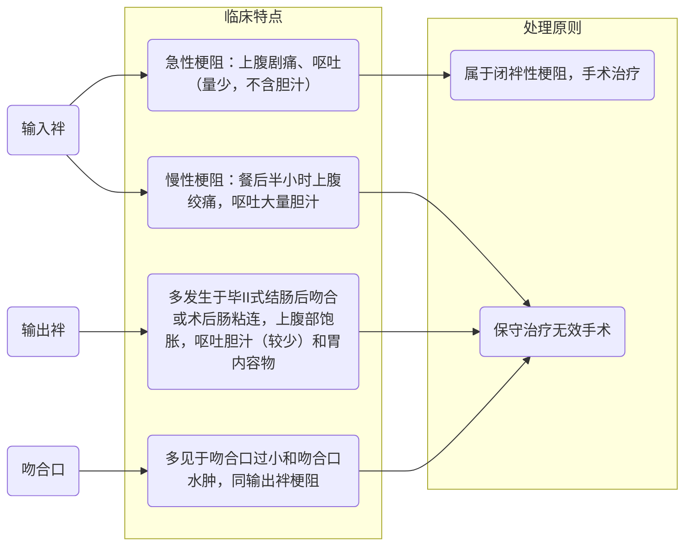
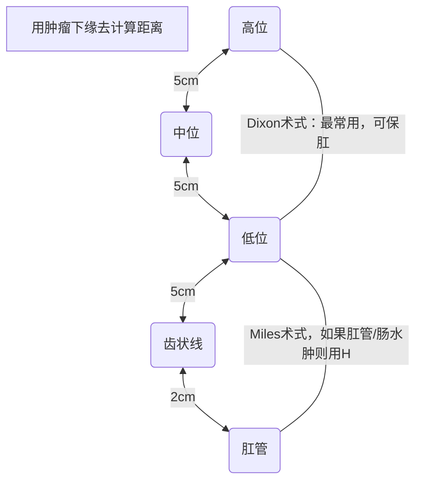
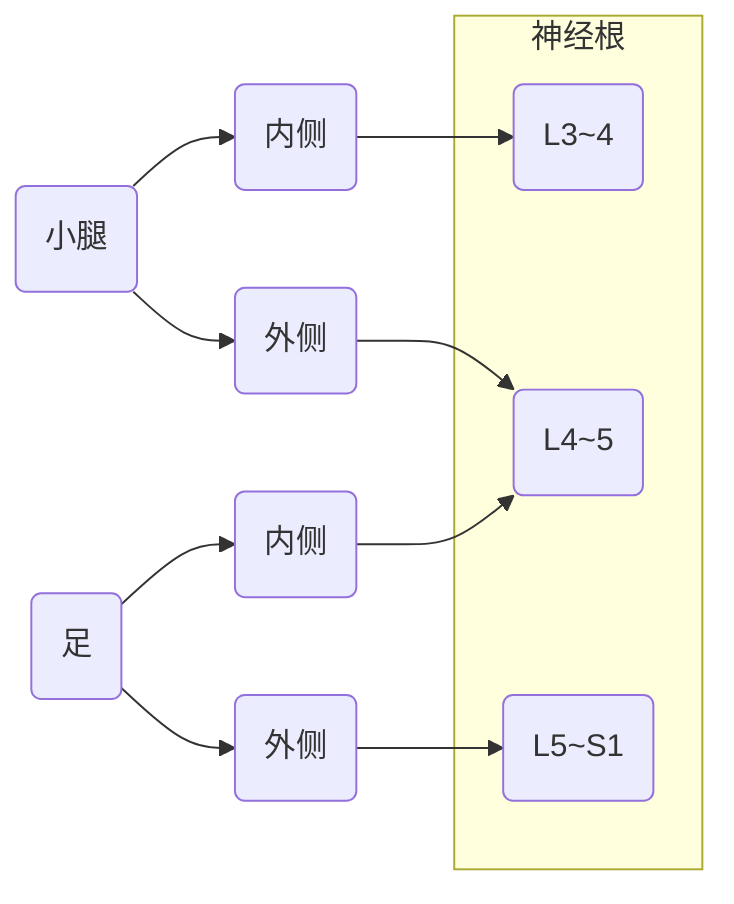
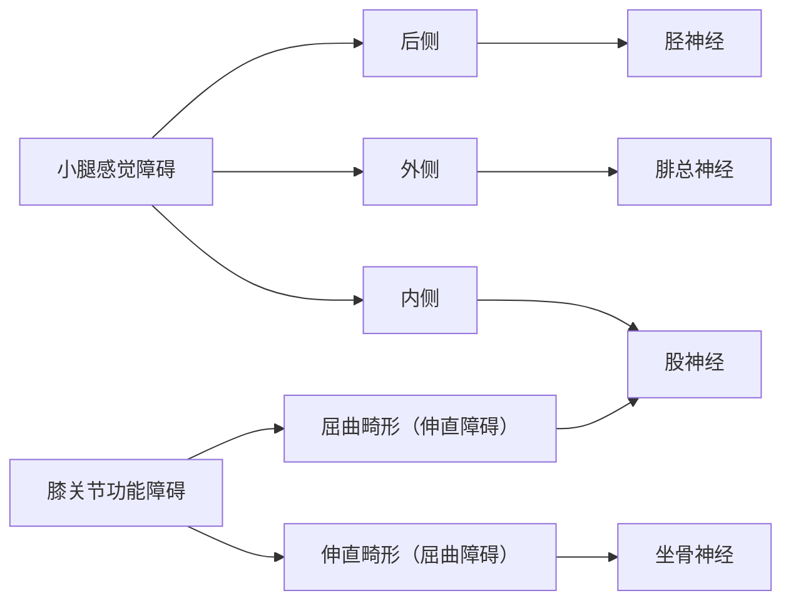

# 第二天

## 慢性萎缩性胃炎的病理改变过程

## 消化性溃疡

主要病因是**幽门螺杆菌感染**。

### 症状

1. **慢性过程**：病程可达数年或十余年
1. **反复或周期性发作**：多在秋冬和冬春之交发病
1. **节律性**：饥饿痛或饱餐痛
1. **腹痛可被抑酸或抗酸剂缓解**

### 体征

发作时剑突下、上腹部或右上腹部可有局限性压痛，缓解后无明显体征。

### 特殊溃疡

1. 复合溃疡：胃、十二指肠均有溃疡
1. 幽门管溃疡：易出现幽门梗阻
1. 球后溃疡：发生在十二指肠降段、水平段
1. 巨大溃疡：直径>2cm的溃疡，常见于有NSAIDS服用史及老年病人
1. 老年人溃疡及儿童期溃疡
1. 难治性溃疡：指经正规抗溃疡治疗，但未能治愈者

### 并发症

1. 出血
1. 幽门梗阻
1. 穿孔
1. Ca

癌肿瘤标记物主要用途：**判断预后及监测复发**。

## 腹股沟疝

腹股沟**斜疝**使肿物不再出现需压迫的位置是**腹股沟管深环**，即**腹股沟韧带中点上方2cm**。

海氏三角：**腹直肌外缘**、**腹壁下动脉**、**腹股沟韧带**

由前到后分别是**斜疝**、**精索**、**直疝**

### 腹股沟管壁构成

方位|解剖结构
--|--
上壁|腹内斜肌、腹横肌的弓状下缘
下壁|腹股沟韧带
前壁|腹外斜肌
后壁|腹横筋膜

## 急性阑尾炎相关并发症

- 术后
    1. 出血：输血补液，紧急手术
    1. **切口感染（最常见）**：排出脓液，放置引流，定期换药
    1. 粘连性肠梗阻：病情重者需要手术
    1. 阑尾残株炎：必要时再次手术切除
    1. 粪瘘：一般非手术治疗
- 本身
  - 阑尾周围脓肿
  - 内外瘘
  - 化脓性门静脉炎或细菌性肝脓肿

## 继发性腹膜炎手术指征

1. 经非手术治疗**6~8小时后（一般不超过12小时）**，腹膜炎症状及体征不缓解反而加重者
1. 腹腔内原发病严重，如胃肠道**穿孔**或胆囊坏疽、绞窄性肠梗阻、腹腔内脏器损伤破裂、胃肠道手术后短期内吻合口漏所致的腹膜炎
1. 腹腔内炎症较重，有大量积液，出现严重的肠麻痹或中毒症状，尤其是有**休克**表现者
1. 腹膜炎病因不明确，且无局限趋势者

腹部损伤外科探查选**正中切口**，而腹膜炎**切口要偏右**，因为腹部右侧**易继发穿孔**的脏器多。

## 肝癌的诊断与鉴别诊断

### 满足下列三项中的一项即可诊断

1. 具有两种典型影像学（超声、增强CT、MRI或肝动脉造影）表现，病灶>2cm
1. 一项典型的影像学表现，病灶>2cm，AFP>400ng/ml
1. 肝脏活检阳性

早期肝癌常常症状隐匿，诊断困难

对肝癌高危人群（各种原因所致的肝硬化以及乙肝、丙肝患者）应每6~12个月行超声和AFP检测，筛查有无HCC发生的早期征象

如有阳性改变，应进一步检查，必要时在超声引导下行肝脏活组织病理检查

## 肝性脑病诊断流程

肝病患者出现以下体征疑诊肝性脑病（HE）：

- 智力下降、健忘
- 性格改变、行为异常、**扑翼样震颤**阳性
- 精神、意识障碍

### 诱因

- 摄入过多蛋白类食物、上消化道出血
- 低钾性碱中毒：进食少、呕吐、腹泻、利尿排钾
- 低血容量与休克：消化道出血，大量腹水、利尿
- 便秘
- 感染：原发性腹膜炎、肺炎、尿路感染等
- 镇静、安眠药
- 其他：应激状态、手术、麻醉等

### 分期

- 0：潜伏期
- 1：前驱期
- 2：昏迷前期
- 3：昏睡期
- 4：昏迷期

## 食管癌

放疗对**鳞癌**、未分化癌效果较好，腺癌作用较差。

对于颈、胸上段（**距门齿25cm内**）优先放疗，因为空间狭小而结构复杂，手术易误伤其它组织。

手术切除范围在癌肿上下**5~8cm处**。

## 胃大切毕II术后并发症

### 早期梗阻

### 远期并发症

#### 1. 碱性反流性胃炎

由于术后碱性胆汁、胰液流入胃中，破坏胃黏膜屏障，导致胃黏膜充血、水肿、糜烂等改变。

主要表现为：上腹或胸骨后灼烧痛；呕吐胆汁样液和体重减轻。抑酸剂治疗无效。可服用胃黏膜保护剂、胃动力药。

#### 2. 倾倒综合征

1. 早期倾倒综合征（餐后半小时内）：
  心悸、心动过速、出汗、无力、面色苍白等一过性**血容量不足**表现
1. 晚期倾倒综合征（餐后2~4小时内）：
  头昏、苍白、出冷汗、脉细弱甚至有晕厥等。由于胃排空过快，含糖食物快速进入小肠，刺激胰岛素大量分泌，继而出现**反应性低血糖**综合征

#### 3. 溃疡复发

溃疡症状再现，有腹痛及出血。可采用制酸剂、抗HP感染保守治疗，无效者可再次手术。

#### 4. 营养性并发症

体重减轻、营养不良、铁与VB12吸收障碍及影响脂肪的吸收。

#### 5. 残胃癌

胃十二指肠溃疡病人行胃大切术后5年以上，残余胃发生的原发癌，可能与残胃常有萎缩性胃炎有关。一旦确诊立即手术治疗。

## 大肠癌Dukes分期

根据病变范围和是否发生转移分期，数字为**深度**，字母为**转移距离**。

分期|肿瘤生长范围
--|--
A|局限于黏膜内（重度上皮内瘤变）
B1|侵及肌层，未穿透，无淋巴结转移
B2|穿透肌层，无淋巴结转移
C1|未穿透肌层，有淋巴结转移
C2|穿透肌层，有淋巴结转移
D|有远隔脏器转移

## 渗出液与漏出液

- 漏出液：心肝肾敏低——心源性、肝源性、肾病、过敏性、低蛋白
- 渗出液：颜面部水肿

## 溃疡性结肠炎与克罗恩病鉴别

-|UC|结肠CD
--|--|--
症状|**脓血便多见**|脓血便较少见
病变分布|连续性|**节段性**
直肠受累|绝大多数|少见
肠腔狭窄|少见，中心性|多见、偏心性
溃疡及黏膜|溃疡浅，黏膜弥漫性充血水肿、颗粒状，脆性增加|纵行溃疡、**黏膜卵石征**，病变间黏膜正常
组织病理|固有膜全层弥漫性炎症、**隐窝脓肿**、**隐窝结构明显异常**、杯状细胞减少|裂隙状溃疡、非干酪性肉芽肿、**黏膜下层淋巴细胞聚集**

## 肠梗阻影像学表现

- 空肠（高位）：鱼骨征
- 回肠（低位）：阶梯状液平
- 结肠：袋型
- 肠套叠：杯口状
- 肠扭转：鸟嘴征

## 急性胰腺炎实验室检查的时间段

7天以前查**血清淀粉酶**，7天左右查**血清脂肪酶**，7天后到2周查**尿淀粉酶**

胰腺所有**肿瘤**首选影像学检查必为**CT**，其他实质脏器或胰腺炎首选**超声**。

## 肠易激综合征的诊断

在除外器质性病变的基础上，

- 腹痛反复发作，症状>6个月，近3个月发生3天/月
- 伴有以下大于等于2条：
  1. 排便后改善
  1. 发作时伴有排便次数改变
  1. 发作时排便性状改变

## 萎缩性胃炎表现

重度萎缩性胃体胃炎患者表现为**胃酸明显减少**

萎缩性胃窦胃炎患者表现为**胃酸正常或减少**

## 肠外营养计算

- 正常：体重 x 25 x 100%
- 择期手术：体重 x 25 x (100% + 10%)
- 感染：体重 x 25 x (100% + 20~30%)
- 大面积烧伤：体重 x 25 x (100% + 100%)

## 体表面积计算

部位|面积
--|--
头面颈|3、3、3
手、前臂、上臂|5、6、7
前胸、后背、会阴|13、13、1
臀、脚|男：5、7 女：6、6
小腿、大腿|13、21

下肢共 5 + 7 + 13 + 21 = 46

## 烧伤分级

- **I度**：疼而无泡，一周愈合（表皮）
- **浅II度**：疼而有泡，剧痛，两周愈合（真皮浅）
  - 有水泡：消毒后穿刺抽吸
  - 水泡已撕脱：油纱覆盖
  - 感染：清除感染分泌物，定期更换纱布
- **深II度**：疼而有泡，痛感迟钝，创面红白相间，三周愈合（真皮深）
- **III度**：焦黄色，可以看到树枝状栓塞的血管，痛觉消失，四周多愈合，应尽早切痂！

## 烧伤分度

- 轻度：II度面积10%以下
- 中度：II度面积11%~30%或有III度但面积小于10%
- 重度：总面积31~50%，或III度面积11~20%，或休克、重吸入性损伤、复合伤
- 特重：总面积大于50%，或III度面积大于20%

## 成人烧伤补液量计算

1. **24h需要量**：体重 x 烧伤面积 x 1.5 + 2000
其中前8h补50%，后16h补另外50%
1. **24h胶体需要量**
    1. 中、重度——晶:胶=2:1 （体重 x 烧伤面积 x 1.5 / 3）
    1. 特重度——晶:胶=1:1 （体重 x 烧伤面积 x 1.5 / 2）

烧伤患者双侧桡动脉搏动减弱，考虑患者患肢因环状焦痂压迫所致，应尽早行骨室筋膜切开减压。

烧伤后水泡多为厌氧环境，需打破伤风

吸入性损伤应用**支气管镜检查**，可以发现气道粘膜水肿、充血、苍白、坏死、剥脱等。

## 乳腺癌

### TNM分型

分型|释义
--|--
T0 | 原发癌未查出
Tis|原位癌
T1 | 癌瘤长径小于等于2cm
T2 | 癌瘤长径2cm~5cm
T3 | 大于5cm或侵及胸壁/皮肤

分型|释义
--|--
N0 | 同侧腋窝无肿大淋巴结
N1 | 同侧腋窝有肿大淋巴结，尚可推动
N2 | 同侧腋窝肿大淋巴结融合，或与周围组织黏连
N3 | 有同侧胸骨旁淋巴结转移

分型|释义
--|--
M0 | 无远处转移
M1 | 有锁骨上淋巴结转移或远处转移

在M分期为0的情况下，T型数字 + N型数字大于等于3小于等于5为三期

一、二期用改良根治，三期术前化疗。

### 化疗药物

- C（环磷酰胺）像一个环
- M（甲氨蝶呤）像蝴蝶
- F（氟尿嘧啶）
- A（多柔比星）阿霉素
- T（多西他赛）

雌激素依赖性肿瘤口服抗雌激素**他莫昔芬**（绝经前）又名三苯氧胺，绝经后用**芳香化酶抑制剂**。

## 腰椎神经根支配区域

## 常见关节脱位

肩关节易发生前脱位，髋关节易发生**后脱位**，造成**坐骨神经**损伤。

> 前肩后髋

### 髋关节脱位

> 前外外，后内内

髋关节中心脱位：出血性休克、大血肿、内脏损伤

## 清创

清创原则

- 神经、肌腱争取一期修复
- 非重要血管可结扎处理
- 主干血管应一期缝合

## 颈椎病

分型|原因|临床表现|治疗
--|--|--|--
脊髓型|髓核后正中突出|颈痛不明显；四肢乏力，行走、**持物不稳**为最初症状，伴有**走路踩棉花感**；自下而上的上运动神经元性瘫痪|**禁用**颌枕带牵引；禁用推拿按摩理疗；药物治疗；手术治疗
神经根型（50~60%，最常见）|髓核侧后方突出|向上肢放射的颈肩痛；感觉异常、肌力下降；神经受压指征；**压头试验**、**上肢牵拉试验**阳性|颌枕带牵引；推拿按摩理疗；药物治疗；无效则手术
交感神经型|颈椎各种病变的刺激|一系列交感神经兴奋或抑制的症状和体征，可有感官异常但不会猝倒|同上
椎动脉型|椎动脉受刺激或压迫|脑供血不足的症状和体征，可有感官异常和**猝倒、晕厥**|同上

## 骨折与易损伤结构

股骨干下1/3骨折——损伤腘窝结构中的**腘动脉**

肱骨干下1/3骨折——损伤腋窝结构中的**正中神经**、**肱动脉**。

髋关节后脱位损伤**坐骨神经**

## 狭窄性腱鞘炎

1. 弹响指
1. 芬氏试验（握拳尺偏试验）：桡骨茎突狭窄性腱鞘炎

## 下肢神经损伤

## 关节脱位体征

1. 弹性固定
1. 畸形
1. 空虚感

## 冷脓肿

结核造成的脓肿，与一般化脓性感染不同，也有疼痛肿胀功能障碍，但没有红、热等现象，是脊柱结核的常见并发症。

诊断：CT

治疗：积极治疗原发病，穿刺是绝对禁忌证！因为会造成瘘。

## 小腿骨折并发症

1. 上1/3：缺血性坏死
1. 中1/3：骨筋膜室综合征
1. 下1/3：延迟愈合

## 前臂双骨折

本质是一根骨折，另一根脱位

- 孟氏：上1/3，尺骨骨折，桡骨头脱位
- 盖氏：下1/3，桡骨骨折，尺骨小头脱位

治疗时**先治疗脱位**，原则为优先治疗简单的、稳定的、相对较粗的。

上2/3尺骨粗，下1/3桡骨粗。

## 肾脏疾病

间质性肾炎确诊依靠**肾活检**。

肾脏疾病与体积关系：急大慢小——急性肾病肾脏体积增大，慢性肾病会萎缩。

**血尿**与任何疾病的轻重程度都没有关系！！！

慢性肾衰的死因是**心衰**，急性肾衰的死因是**高钾**。

### 肾小球疾病的临床分型

1. 急性肾炎
1. 急进性肾炎
1. 肾病综合征
1. 无症状血尿和/或蛋白尿

原发性肾小球疾病不包括**IgA肾病**！！

### 肾性骨病

1. 骨软化症
1. 骨硬化症
1. 骨质疏松
1. 纤维性骨炎

肾性骨病是我国医学家首次提出的，并通过**骨化三醇**来治疗。

尿毒症导致肾性骨病的机制：肾脏内分泌（**骨化三醇**）功能下降继发性导致**甲状旁腺功能亢进**，进而造成**骨质流失、破坏**。

对糖皮质激素治疗最为敏感的肾病综合征病理类型是**脂性肾病**。

### 蛋白尿速记

- 魏小梅——微球蛋白、溶菌酶都为**肾小管性蛋白尿**
- 红一周——血红蛋白、肌红蛋白、本周蛋白都为**溢出性蛋白尿**
- 组织退货——TH蛋白为**组织性蛋白尿**
- 肾小球性蛋白尿
  - 选择小白
  - 非选大补球（大分子蛋白、补体、免疫球蛋白）

### 泌尿结石

> 草酸钙石最常见，尿胱氨酸看不见，磷酸（碱性最常见）感染鹿癌变

### 管型

管型即肾小管将内容物塑形

- 透明管型：一般见于正常人
- 蜡样管型：慢性肾衰竭，终末期肾病
- 白细胞管型：感染（上尿路）
- 颗粒管型：肾炎、肾病
- 上皮细胞管型：肾小管上皮细胞坏死、脱落 -> 急性肾小管坏死 -> 急性肾衰
- 红细胞管型：急性肾炎、急进性肾炎
- 脂肪管型：肾病综合征

## 膀胱癌TNM分期

速记口诀：1固有电切，2肌层部分，3周围全切，4远处灌注（丝裂霉素、卡介苗）

判断膀胱肿瘤恶性程度的依据是**肿瘤的浸润深度**。

## 睾丸肿瘤

婴幼儿易发生**卵黄囊肿**，成人易发生**精原细胞瘤**
