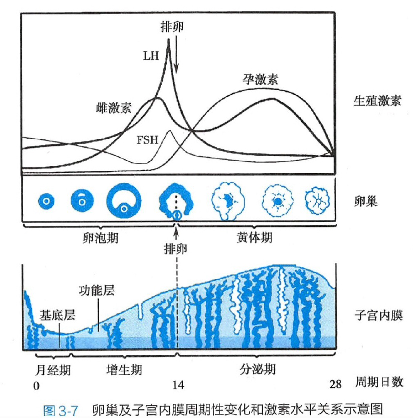

# 妇产科学

## 解剖

女性内外生殖器官血液供应的主要来源：**卵巢动脉**、**子宫动脉**、**阴道动脉**、**阴部内动脉**

### 外阴

阴阜有丰富的皮下脂肪，作用为保护

大阴唇富含神经末梢，有腺体所以平常湿润，位置在两股内侧，内外都是**皮肤皱襞**，最容易受到外伤，血管丰富，故易血肿

阴蒂由海绵体构成，分为头、体、脚，阴道口的肌肉**球海绵体肌**为体的组成

小阴唇为大阴唇内侧的皮肤皱襞，**不是黏膜**！！神经末梢更加丰富

阴道前庭为两侧小阴唇内侧的菱形区域，有三个开口——尿道口、阴道口和前庭大腺

阴道粘膜上皮为**复层鳞状上皮**，宫颈粘膜上皮为**单层柱状上皮**

子宫动脉、阴道动脉、阴部内动脉都从**髂内动脉**分支而来

会阴及外生殖器的淋巴直接汇入**腹股沟浅淋巴结**

### 子宫

**子宫韧带**：

- 子宫主韧带：横行于子宫颈两侧和骨盆侧壁之间，又叫子宫颈横韧带，从底部拖住子宫，防止其下垂
- 子宫圆韧带：起于子宫角，终于大阴唇，保持**子宫前倾**
- 子宫阔韧带：不是肌纤维，是结缔组织，固定子宫不向两侧倾倒
- 骶子宫韧带：维持子宫前倾

> 霍琨老师：
>
> 我们将盆腔想象为**没有封底**、底端仅**铺有一木板**的铁桶，将子宫与固定装置想象为桶内坐着的**小人**。
>
> 其身体**前倾**，屈腿坐于木板上，并将脸埋于两膝之间，双脚踩在桶壁底部的开口上，两臂张开扒住桶壁上缘，腰部系了两条固定在后桶壁上的安全绳，小人的腰因此被拉向后壁，上身**呈前屈位**。
>
> 最后，用一块宽大的布料以小人双臂所在长轴为中心，完全遮盖住小人。这样，小人就安全而稳固地坐在了桶内。
>
> 我们可以将此与解剖结构一一对应：
>
> 木板对应了承托子宫颈、防止其下沉的**子宫主韧带**，小人的双腿对应了维持前倾的**子宫圆韧带**，腰部两条安全绳对应了维持子宫前屈的**骶子宫韧带**，而覆盖于小人周身、从双臂开始自然垂落的布料对应了**子宫阔韧带**，前部的布料称阔韧带**前叶**，后部的布料称阔韧带**后叶**。

子宫各部是**不对称**的球形

子宫内膜分为**3**层：

- 功能层，受卵巢性激素影响，发生周期性变化而脱落
  - **致密层**
  - **海绵层**
- 不受卵巢性激素影响，不发生周期性变化
  - **基底层**

**子宫峡部**是子宫体与子宫颈之间形成的**最狭窄部分**，**非孕时**长约**1cm**，妊娠后逐渐伸展变长，**临产后**伸展至**7~10cm**，成为产道的一部分。

**子宫动静脉**走行在**子宫阔韧带**中，
**卵巢动静脉**走行在**卵巢悬韧带（骨盆漏斗韧带）**中。

子宫切除术：只切**卵巢固有韧带**，不切**卵巢悬韧带（骨盆漏斗韧带）**，
子宫及附件切：切**卵巢悬韧带（骨盆漏斗韧带）**，无需切**卵巢固有韧带**。

> 子宫全切**不漏斗**，子宫附件**不固有**，次全切不切主

切除子宫韧带时，**卵巢固有韧带**和**子宫圆韧带**不损伤输尿管（带“口”的不损伤），
最容易损伤输尿管的是**子宫主韧带**

**血管**：

- 子宫动静脉在阔韧带基底部，宫颈旁2cm的地方，主韧带之上穿过
- 输尿管在该位置与子宫动脉有交叉，上为子宫动脉，下为输尿管（**桥下流水**）
- 子宫动脉、阴道动脉、阴部内动脉都从**髂内动脉**分支而来
- 子宫动脉为**髂内动脉前干**的分支

### 卵巢

卵巢像一个鸡蛋，外壳是**生发上皮**，膜是**白膜**，蛋白是**皮质**，蛋黄是**髓质**，卵巢**无腹膜覆盖**。

卵巢固有韧带，又叫骨盆漏斗韧带，只有连结作用

骨盆漏斗韧带走行的是**卵巢动静脉**，**不是**子宫动静脉

卵巢动脉来源于**腹主动脉**

右侧卵巢静脉汇入下腔静脉，左侧卵巢静脉汇入左肾静脉——**右腔左肾**

### 骨盆

平面|测量部位|数值
--|--|--
骨盆入口平面|髂嵴间径|骨盆入口前后径，11cm
中骨盆平面|坐骨棘间径|中骨盆的横径，10cm
骨盆出口平面|坐骨结节间径、出口后矢状径|骨盆出口的横径，9cm

骨盆入口平面：**骶耻外径**、对角径
中骨盆平面：坐骨棘间径、坐骨切迹
骨盆出口平面：坐骨结节间径、后矢状径

与中骨盆狭窄无关的是：**骶尾关节活动度**

具有**支持作用**的骨盆底肌肉是**肛提肌**。

**骶耻外径**有助于判断骨盆狭窄

## 生理

排卵后**7~8天**黄体体积和功能达到高峰，
若卵子未受精，黄体在排卵后**9~10日**开始退化，
组织纤维化成为白体，14日完全结束。

无周期性变化的组织：

1. 卵巢生发上皮：虽然每次排卵都会被顶破，但不会恢复！（像一个莲蓬）
1. 卵巢髓质
1. 子宫内膜基底层

### 青春期

- 青春期最早的表现是**乳房发育**
- 青春期的标志是**月经初潮**
- 乳房发育在月经初潮前**两年到两年半**
- 卵巢体积增大，表面凹凸不平
- 性腺轴（下丘脑-垂体-卵巢）功能发育不健全，导致功能性月经紊乱，即不规律，可能为无排卵月经

月经来潮的原因是：**血中雌激素、孕激素**水平都**降低**（撤退出血）

### 月经

**月经周期**：

- 第1天——月经周期开始
- 第5天——增殖早期开始
- 第8天——增殖中期开始
- 第11天——增殖晚期开始
- 第15天——分泌早期开始：形成**糖原小泡**，间质水肿
- 第20天——分泌中期开始：**顶浆分泌**，间质疏松肿大，高度水肿
- 第24天——分泌晚期开始：**有糖原分泌/溢出**，间质疏松水肿/肿大

> 整体开始时间记为手机号 158-1115-2024

月经周期长短取决于**增生期**长短，因为分泌期是比较固定的14天。

### 激素

- 胆固醇合成的**类固醇激素**
  - 孕激素
  - 雄激素
  - 雌激素
- **糖蛋白激素**
  - 腺垂体的促性腺激素细胞
    - FSH
    - LH
  - 合体滋养层细胞分泌
    - hCG

合成途径：孕激素 -> 雄激素 -> 雌激素

导致排卵最直接的原因是：**LH（黄体生成素）最高峰**

催乳素促进乳汁**合成**，
催产素促进乳汁**排出**，
卵泡刺激素促进卵泡成熟，
黄体生成素促进排卵。

直接调控卵巢的周期性变化，是**促卵泡刺激细胞**和**黄体生成素**的共同作用。

卵巢及子宫内膜周期性变化和激素水平关系示意图

### 雌激素

1. 促进外生殖器和第二性征的发育
1. 促进子宫发育
1. 促进输卵管发育及上皮的分泌
1. 使阴道上皮细胞增生和角化，粘膜变厚，并增加细胞内糖原含量，使阴道维持酸性环境
1. 使子宫内膜腺体和间质增生、修复
1. 通过对下丘脑和垂体的正反馈调节，控制促性腺激素的分泌
1. 促进骨中钙的沉积，加快骨的成熟和骨骺愈合
1. 促进肝脏HDL的合成，抑制LDL的合成，降低循环中胆固醇水平

雌激素在**肝脏**代谢，所以肝硬化的蜘蛛痣为雌激素不能被灭活造成。

雌激素E2活性大于E3，但**评价胎盘功能**一般用**E3**。

> E1老妇，E2少妇，E3孕妇

雌激素有排卵前和排卵后**两个**高峰，前者来源于**卵泡壁细胞**，后者来源于**黄体**，
孕激素仅有**排卵后**一个高峰，来源于**黄体**，
卵泡刺激素（FSH）和黄体生成素（LH）都有促进**卵泡发育**的功能，所以都仅有**排卵前**一个峰。

雌激素的正反馈：垂体释放FSH（促卵泡生成素） -> 促进卵泡发育 -> 卵泡膜细胞释放雌激素 -> 促进垂体释放FSH

### 雌激素 vs. 孕激素

靶器官/部位|雌激素|孕激素
--|--|--
子宫|1. 提高子宫平滑肌对缩宫素的敏感性 2. 对子宫内膜有增生作用 3. 促进宫颈黏液分次增多，性状变稀薄|1. 降低子宫对缩宫素的敏感性 2. 使增生期的子宫内膜进入到分泌期 3. 抑制宫颈黏液分泌，性状变粘稠
输卵管|加强输卵管节律性收缩|抑制输卵管的收缩
阴道|促使阴道上皮增生和角化|促使阴道上皮脱落
乳腺|使乳腺管增生，乳晕、乳头着色|使乳腺腺泡发育
水和钠|促进水钠潴留|促进水钠排泄
其他|协同促卵泡刺激素促进卵泡发育，使宫颈口松弛扩张|使子宫肌肉松弛，使排卵后基础体温升高0.3~0.5°C
来源|排卵前：卵泡膜细胞和颗粒细胞 排卵后至孕10周：黄体细胞 孕10周后：胎儿-胎盘单位（主要分泌E3）|排卵前：颗粒细胞 排卵后至孕10周：黄体细胞 孕10周后：胎盘合体滋养细胞

> 要10周，胎盘才接管黄体，才会开始分泌E3，
> 至妊娠末期，E3值为非孕妇女的**1000倍**，E2及E1值为非孕妇女的**100倍**。
>
> 雌激素造成的改变是为了受精，孕激素造成的改变是为了保胎和生产。
>
> 凡是积极向上的、促进的、增多的、蠕动的都是**雌激素**，反之为孕激素
>
> 一切**增生**都为雌，一切**分泌**都为孕。

雌激素和孕激素有分工、合作、拮抗的生理作用。

关系|部位|雌激素|孕激素|补充
--|--|--|--|--
合作@span:0,2|乳腺|腺管|腺泡|促进增生——雌管孕泡
合作|子宫内膜|增生|分泌|无
拮抗@span:0,3|阴道上皮|增生、角化|皱缩、卷曲|无
拮抗|宫颈口|松弛，黏液稀薄，羊齿样结晶|闭合，黏液粘稠，椭圆体结晶|无
拮抗|输卵管|增加蠕动|减少蠕动|无

3个激素对乳腺的影响：

- **雌激素**促进**乳腺腺管**发育
- **孕激素**促进**乳腺腺泡**发育
- **催乳素**促进乳腺腺泡**分泌**

宫颈黏液中的蛋白质、糖和某些电解质相结合，
于涂片干燥后出现结晶，雌激素**促进羊齿状结晶形成**，
孕激素抑制其形成，黏液分泌量逐渐减少，
使质地黏稠而浑浊，涂片检查时结晶逐渐模糊，
至月经周期第22日左右完全消失，
代之以排列成行的**椭圆体**，孕激素 -> 椭圆体。

## 妊娠

妊娠全过程约280天，即40周。

受孕周数 = 受精周数 = 妊娠周数 - 2周

成熟卵子**受精**是妊娠的开始！！

受精多在排卵后的数小时内发生，一般**不超过24小时**，结合部位在**输卵管壶腹部**。

受精成功第**6~7天**着床

**黑加征**：停经**6~8周**时，双合诊检查子宫峡部极软，感觉宫体与宫颈似不相连，称黑加征，是妊娠早期**最特异**的症状。

**早孕反应**：6周开始，12周后消失

妊娠**8周**子宫增大到非孕时的2倍，**12周**到非孕时的3倍

受精后，前8周称为**胚胎**，**第9周**起称为**胎儿**。

孕妇在妊娠**8~10周**时血清hCG浓度达到高峰。

**12周**出现不规律宫缩。

**围生期**：从妊娠满28周至产后1周。

妊娠晚期子宫容量约为**5000ml**。

妊娠晚期子宫**轻度右旋**，与乙状结肠在左有关。

妊娠晚期**无乳汁分泌现象**，是因为大量的雌、孕激素抑制了乳汁的生成。

**初乳**是妊娠末期，尤其在接近分娩期，挤压乳房时出现的**少量淡黄色稀薄液体**。

孕妇于妊娠后期常有踝部及小腿下半部**轻度水肿**，但**休息后可消退**。若未能应考虑合并妊高症、肾脏疾病等。

孕妇需要蛋白质最高的时期是**孕晚期**：孕早期基础代谢率稍下降，于孕中期逐渐增高，至孕晚期可增高**15~20%**，相应的蛋白质需要量在孕中期（4~6个月）每日增加**15g**，孕晚期（7~9个月）是需要蛋白质的最高时期，每日增加**25g**（*胎儿越大，需求越多*）

**胎膜**功能：母体与羊水的交换、缓冲作用、防止压迫和撞击的作用。

胎儿肺泡表面活性物质**18~20周**开始产生，**28周**出现在羊水里，**35~36周**迅速增高至成熟水平。
所以**28周**是**早产儿**的分界标志。

早期妊娠的确诊依据是**B型超声检查**：**5囊6芽8胎心**——5周妊娠囊，6周胎芽，8周原始心管搏动

妊娠最早的症状：**停经**

胎心音**110~160次/分**，子宫杂音和**母体心率**一致，脐带杂音和**胎心音**一致。

### 各系统变化

- **生殖系统**
  - 阴道皱襞增多，伸展性增加
  - 卵巢排卵、新卵泡发育均停止
  - 子宫各部增长速度：宫底增长最快，宫颈最少
  - 12周，子宫峡部逐渐变软、伸长、变薄，扩展为宫腔的一部分，临产后伸展至7~10cm，成为软产道的一部分，称为**子宫下段**，是产科手术学的重要解剖结构，也是剖宫产最佳切口。——*注：并不是在妊娠晚期才开始变软延长！！*
  - 宫颈管黏液增多，形成黏稠黏液栓
- **循环系统**
  - 心脏叩诊浊音界增大，心脏向左前上方移位，心尖搏动左移1~2cm
  - 闻及收缩期柔和吹风样杂音——因回心血量增加导致的相对二尖瓣闭合不全
  - 心率增快而有心悸，于妊娠晚期休息时每分钟增加10~15次
  - 收缩压变化不大，舒张压减小，脉压增大
  - **心容量**至妊娠末期约增加**10%**
  - 左侧卧位**心排量**增加约**30%**，至妊娠**32~34周**达到最大
  - **血容量**增加**40～45%**
  - 妊娠晚期仰卧位时增大的子宫压迫下腔静脉，回心血量减少、心排出量减少使血压下降，称仰卧位低血压综合征
- **内分泌系统**：*二高一少一不变*
  - PRL、皮质醇升高
  - 促性腺激素减少
  - 游离甲状腺激素不变

### 羊水

来源：

- 早期：**母体血清**经胎膜进入羊膜腔的透析液
- 中期：**胎尿**
- 晚期：**胎尿**和**肺泡液**（胎肺分泌物）

体积变化（mL）：

- 8周：5~10
- 10周：30
- 20周：400
- 38周：1000（最多）
- 40周：800（足月）
- 42周：300（过期）

**胎儿吞咽**可以使羊水量趋于平衡。

### 妊娠周数的宫底位置

周数|位置
--|--
12周末|耻骨联合上2~3横指
16周末|脐耻之间
20周末|脐下1横指
22周末|平脐
24周末|脐上1横指
28周末|脐上3横指
32周末|脐与剑突之间
36周末|剑突下2横指
40周末|脐与剑突之间或略高

> 最低最高（月份）两中间，剩下全与脐相关：
>
> 最低3，最高9，两中间4、8，剩下5、6、7

### 孕妇用药

1. 孕妇禁用左氧氟沙星
1. 3-8周最易致畸
1. 12周内用药要谨慎
1. 能用一种不要联合，能小剂量不大剂量
1. 及时减量停药
1. 必须用药需先终止妊娠再用药

### 孕期吸烟的影响

- **自然流产率增加**
- **胎儿死亡率增加**
- **低体重儿**
- **胎儿畸形**
- 但与新生儿死亡**无关**

### 妊娠全过程汇总

妊娠周数（末次月经起算）|生理变化
--|--
2周|受精卵结合于输卵管壶腹部，此时雌、孕激素来源于黄体细胞
3周|受精卵着床
5周|超声观察到妊娠囊
6周|在此之前可使用尿妊娠试验，早孕反应出现，超声能够观察到胎芽，6~8周出现黑加征
8周|羊水量5~10ml，子宫增大到非孕时的2倍，早孕反应消失，超声能够观察到心管搏动，8~10周血清hCG达到高峰
10周|羊水量30ml，此时胎盘替代黄体功能，雌激素来源于胎盘单位，孕激素来源于胎盘合体滋养层细胞
12周|子宫增大到非孕时的3倍，子宫峡部逐渐变软伸展扩展为宫腔的一部分，出现不规律宫缩
16周|16~20周可自觉胎动
18周|18~20周胎儿肺泡表面活性物质开始产生
20周|羊水量400ml，可听诊胎心，触及胎体
24周|可区分头背臀
28周|胎儿肺泡表面活性物质出现在羊水里，此时为早产儿的分界线，我国采用的围生期规定为从妊娠满28周至产后1周
32周|32~34周左侧卧位心排量达到顶峰约30%
35周|35~36周羊水中的肺泡表面活性物质迅速增高至成熟水平
38周|羊水量1000ml（最多）
40周|羊水量800ml（足月）
42周|羊水量300ml（过期）

## 胎盘与胎儿

脐带表面有**羊膜**覆盖呈灰白色，内有**两条脐动脉**，共同环绕**一条脐静脉**。

胎盘由属于胎儿部分的**羊膜**、**叶状绒毛膜**以及属于母体部分的**底褪膜**组成。

底褪膜的作用是**构成胎盘母体面**，胎盘的功能是**排泄胎儿代谢产物**、**合成激素和酶**、**产生孕激素**。

叶状绒毛膜分两层，内层为细胞滋养层细胞，外层为**合体滋养层细胞**。

合体滋养细胞产生：hCG、hPL、孕激素、缩宫素酶
胎儿-胎盘单位产生：雌激素

**先兆子宫破裂**：因头位不正，软产道过度拉长导致的难产，下腹部出现环形凹陷称为**病理缩复环**，同时可能伴有血尿。

**前置胎盘**：胎盘着床于子宫下段，随着孕晚期（28周）宫颈拉长，胎盘不会被拉长，导致血管破裂，表现为无诱因**无痛性出血**，首选剖宫产。

**胎盘功能**：

1. 供给营养
1. 排泄废物
1. IgG透过胎盘形成免疫
1. 内分泌功能
1. 物质交换
    - **易化扩散**：葡萄糖，胎儿代谢主要能源
    - **主动转运**：钙镁磷铁，**氨基酸**
    - **简单扩散**：钾钠镁，脂溶性维生素

**胎心音听诊**：

- 头先露时多在脐下
- 臀先露时多在脐上
- 肩先露时多在脐周

**胎头触诊**：

> 胎头圆而硬，有浮球感；  
> 胎背宽而平坦；  
> 胎臀宽而软，形状不规则；  
> 胎儿肢体小且有不规则活动；  
> 24周后可区分胎头胎背。

### 胎儿生产名词

- **胎姿势**——胎儿在子宫内的姿势
- **胎产式**——胎体纵轴与母体纵轴的关系
- **胎先露**——最先进入骨盆入口的胎儿部分
- **胎方位**——胎先露的指示点与母体骨盆的关系
- **骨盆轴**——连接骨盆各平面中点的假想曲线

### 胎儿营养物质交换方式

物质|交换方式
--|--
钠钾镁、脂溶性维生素、游离脂肪酸、水、氧气及二氧化碳|简单扩散
葡萄糖|异化扩散，胎儿代谢的主要能源
氨基酸、钙磷铁碘|主动转运

## 分娩

分娩减速：

1. 早期减速：胎头受压
1. 变异减速：脐带受压
1. 晚期减速：有宫缩选**缺氧**，否则选胎盘功能减退

> 早压晚缺变异脐

与宫缩有关且同时发生就是早期减速，胎头受压；
无关，就是变异减速，脐带受压
有关但是晚于宫缩，就是晚期减速，胎儿窘迫，缺氧

**第二产程**心脏负担最重

**产后宫体肌纤维缩复**：

- 产后1天——平脐
- 产后1周——孕3月大小（耻骨联合）
- 产后10天——盆腔内
- 产后6周——非孕大小

> 一日平脐周耻三，十日入盆六周还

**产后出血**：

1. 子宫收缩乏力（最主要最常见）
1. 胎盘娩出后子宫柔软轮廓不清：宫缩乏力
1. 软产道裂伤：胎儿娩出后持续鲜红血液，处理为娩出胎儿以后逐层缝合
1. 几分钟后出血：胎盘部分剥离，处理为手动剥脱
1. 凝血功能障碍：持续不止、不凝，应输血

过期妊娠一定要**核对停经史**

羊水深度＜3厘米 胎盘功能减退——OCT试验
羊水深度＜2厘米 胎儿窘迫——剖宫产

①妊娠期血压＞140/90→妊高症→(降压处理)

②妊娠期血压＞140/90+尿蛋白(+)+无抽搐→子痫前期

③妊娠期血压＞160/110 or 尿蛋白(+++)/ ＞5g/24h+无抽搐→重度子痫前期

有呕吐→甘露醇    无呕吐→硫酸镁预防

④妊娠期血压＞140/90+蛋白尿+抽搐→子痫→(静点硫酸镁)

流产最常见原因：

早产-生殖道感染
早期流产-染色体异常
晚流-子宫解剖异常

流产类型：

宫口开，子宫小于孕周，阴道淋漓出血。不全流产。(易感染、失血性休克)——清宫术
宫口开，子宫等于孕周。难免流产。
宫口闭，子宫等于孕周，B超提示胎儿存活。先兆流产(保守治疗)
宫口闭，子宫正常大小。完全流产(不用处理)
宫口闭，子宫小于孕周，无不适。稽留流产(易DIC，尽早手术)

清宫术后仍流血不止应**测hcg**看有没有残留组织。

流产合并感染：有效控制感染同时，行宫内感染组织钳夹术（宫腔镜下而非产钳）

怀疑异位妊娠，未破首选B超，已破首选穿刺。

做题题眼：
 血压≥160/110mmHg
🍁无抽搐：重度子痫前期
🍁有抽搐：子痫
治疗：硫酸镁，甘露醇，剖宫产。

子痫前期➡️140/90
重度子痫前期➡️160/110，尿蛋白>5
子痫➡️抽搐

禁用硝普钠！可引起胎儿氰化物中毒

妊娠期高血压的原因是**总外周阻力增加**

孕周＜35周的子痫前期患者，预计1周内可能分娩者均应给予糖皮质激素
本例孕38周，无需促胎肺成熟

子痫前期使用硫酸镁必备条件包括：
①膝腱反射存在；
②呼吸≥16次/分；
③尿量≥17ml/h或≥400ml/24h；
④备有10%葡萄糖酸钙。
镁离子中毒时停用硫酸镁并静脉缓慢推注（5～10分钟）10%葡萄糖酸钙10ml。

以下情况立刻终止妊娠：

1.频繁晚期减速或者重度变异减速
2.胎动＜10 次/2 小时或者减少 50% 以上
4. 重度羊水污染(深绿色羊水)
5.胎儿头皮血 PH＜7.2，Pa ＜10mmhg
6.羊水深度小于2cm

妊娠期糖尿病、妊娠期合并慢性高血压  终止妊娠最佳时间38～39w

妊娠期高血压：先有妊娠再有高血压
妊娠合并慢性高血压：先有高血压再有妊娠
糖尿病合并妊娠：先有糖尿病再有妊娠
妊娠期糖尿病：先有妊娠再有糖尿病

妊娠期高血压：妊娠20周后出现高血压，无蛋白尿
妊娠合并慢性高血压：妊娠20周前出现高血压，妊娠期无明显加重
子痫前期：妊娠20周后出现高血压，伴蛋白尿
                    重度子痫前期：收缩压大于等于160或舒张压大于等于110
                    慢性高血压并发子痫前期：先没有蛋白尿后有蛋白尿
子痫：子痫前期基础上伴抽搐

孕妇禁用ACEI和ARB

黄疸+尿胆红素（-）---妊娠急性脂肪肝
黄疸+尿胆红素（+）---重型肝炎

产检：有并发症的32周每周产检一次
无并发症的36周每周产检一次

正常产妇：👑20-36w👑每4周一次
37w后每周一次
合并心脏病：20w前每2周一次
20w后，尤其👑32w后每周一次

胰岛素促进蛋白和脂肪合成，抑制脂肪分解

双顶径＞10cm才考虑巨大儿

首先这道题考的是室间隔缺损程度：
轻度室间隔缺损:＜0.5cm
中度室间隔缺损:0.5-1cm
重度室间隔缺损:＞1cm
其次考处理：
小于7w，药物
7-10w，负压吸引
10-14w，刮宫
16--27w，利凡诺引产
胎龄较大，剖宫

母体血糖高—>胎儿血糖高—>胎儿产生尿液多（高渗）—>羊水多

产程过程当中进食不规律，需要停用皮下胰岛素，改静脉滴注
剖宫产术日停用胰岛素

母亲乙肝病毒携带者，胎儿疫苗、抗体都要打。

TORCH：结合胆红素升高，肝功能异常

HELLP综合征是妊娠期高血压疾病的严重并发症，以溶血（H）、肝酶升高（EL）和血小板减少（LP）为特征，属于子痫前期的特殊类型，起病急骤、病情凶险，母婴死亡率高。

孕妇梅毒青霉素，孕妇淋病头孢曲松

梅毒:首选青霉素 过敏用头孢曲松钠
淋病: 首选头孢曲松 妊娠期禁用氟喹诺酮 四环素
生殖道沙眼衣原体: 阿奇霉素红霉素
生殖器疱疹: 阿昔洛韦

梅毒：苍白螺旋体

沙眼衣原体：CT-DNA阳性，阴道脓性分泌物，Glemsa染色可见包涵体——沙眼衣原体感染——首选阿奇霉素

妊娠期阑尾炎手术：3个月前（妊娠早期）可取“麦氏切口"。14—27周（妊娠中期）手术切口偏高。

胎心正常频率110-160次/分
胎儿窘迫就看胎心最简单，小于110

S±n：即**坐骨棘-胎先露位置**，S代表骶骨。
数字代表胎先露最低点相对于坐骨棘水平的厘米数。

小于s➕3选剖宫产
S➕3选产钳
大于s➕3选抬头吸引

死胎在腹中停留过久易造成凝血功能障碍和DIC

死胎后引产用米索前列醇

双胎类型：

双绒毛膜+双羊膜：住在两个不同的房子里。
单绒毛膜+双羊膜：合租，同一个房子里，每人一个房间。
单绒毛膜+单羊膜：住在同一个房间

双胎输血综合征：多见于单绒毛膜双羊膜囊双胎，通过胎盘间的动－静脉吻合支，血液从动脉向 静脉单向分流，使一个胎儿成为供血儿，另一个胎儿 成为受血儿，造成供血儿贫血、血容量减少，致使肾 灌注不足、羊水过少，甚至因营养不良而死亡；受血 儿血容量增多，可发生充血性心力衰竭、胎儿水肿、 羊水过多。

选择性胎儿生长受限：为单绒毛膜性双胎特有的严重并发症。

第二胎体位变化：第一胎分娩出后，宫内有压力骤降，为了减少对第二胎头部的压迫，所以臀先露可以减少对胎儿头部的压迫，降低胎儿窘迫的风险。

前置胎盘
＜36周，情况尚且稳定，可行期待疗法；不稳定则剖宫产
≥36周，行剖宫产（阴道试产只适用于边缘和低置胎盘，情况稳定无剖宫产指征，短时间内可以完成分娩）
胎盘早剥
一般情况下剖宫产
胎膜早破
＜12小时80%可自然临产
＞12小时药物引产

胎盘植入性疾病，简称“胎盘植入”，是胎盘组织不同程度的侵入子宫肌层的一组疾病的统称，包括：胎盘 粘连、胎盘植入及穿透性胎盘植入，与胎盘早期剥离 无关。

规律腹痛前阴道留液为胎膜早破，足月且在破膜2-12小时内，应积极引产——静滴缩宫素加强宫缩

血压升高➕蛋白尿🟰妊高症（胎盘早剥高危因素）+子宫持续收缩（硬）+疼痛+出血（出血量和休克不符）=胎盘早剥

子宫胎盘卒中，又称库弗莱尔子宫，即胎盘早剥发生内出血时，血液积聚于胎盘与子宫壁之间，随着胎盘后血肿压力的增加，血液浸入子宫肌层，引起肌纤维分离，断裂甚至变性，当血液渗透至子宫浆膜层时。

席汉综合征：又称产后垂体功能减退症，由于孕妇在分娩时或产后发生大出血，造成垂体前叶急性缺血坏死，发生永久性功能减退。

孕妇遭受撞击可能造成胎盘早剥，应超声探查和给予镇静药物严密观察。

绒毛羊膜炎：热臭快，白细胞高——发热，阴道流出物臭味，心率增快

如果已经进入产程 血压高 可观察
如果还没进入产程，血压高，需使用降压药

28周孕妇羊水过少，羊水大部分是由胎儿尿液组成，考虑胎儿泌尿系统畸形，所以需要排除胎儿畸形

引导突然流液，摸到条索状→考虑脐带脱垂
宫口开全→阴道分娩
宫口未开全→剖宫产
产妇立即取头低臀高位，将胎先露部上推，应用抑制子宫收缩的药物，以缓解或减轻脐带受压，严密监测胎心，同时尽快行剖宫产

子宫收缩力：分娩时最主要的产力

一、第一产程：
正式临产到宫口开全，即宫口开到10cm，一般初产妇需要10-12个小时，经产妇需要6-8小时。
二、第二产程：
为胎儿娩出期，即从宫口开全至胎儿娩出，一般需要1-2个小时。
三、第三产程：
胎盘娩出期，即从胎儿娩出到胎盘娩出，约需5-15分钟，不超过30分钟。

第一产程:子宫收缩力
第二产程:子宫收缩力，腹肌和膈肌收缩力、肛提肌收缩力
第三产程:子宫收缩力，腹肌和膈肌收缩力、肛提肌收缩力
肛提肌收缩力：第二产程内旋转及仰伸

胎方位：

矢状缝是胎儿大囟门到小囟门之间的连线

骨盆入口左斜径是产妇的右上到左下

左斜径➡️枕右前，枕左后
右斜径➡️枕左前，枕右后

1️⃣先兆临产：
①见红（先兆临产标志）
②不规律宫缩
③胎儿下降感
2️⃣临产
①规律且渐强的宫缩（标志）
②进行性宫颈管消失，宫口扩张
③胎先露下降

先兆早产：不规律宫缩伴宫颈管进行性缩短
早产临产：规律宫缩伴宫颈管进行性缩短＋宫口扩张≥2㎝
先兆临产：无宫颈管缩短＋宫口扩张的不规律宫缩＋见红＋胎儿下降感

规律渐强的宫缩：临产的标志

宫缩乏力第二产程处理，不是什么胎儿窘迫
＜S+3：剖宫产
S+3：产钳
＞s+3：胎头吸引

只有到S+3以后才能依靠外界把小孩拽出来，S+3以内够不着，必须得剖宫产。超过S+3的话，胎方位不对，就手动转到正常胎方位，即左枕前，位置对了，S+3直接用产钳拉出来，如果小孩下降更多，可以用胎头吸引，这样对小孩损伤更小。

生产名词

- 小于28周
    - 先兆流产：见红+腹痛+宫口未开+子宫大小符合孕周
    - 难免流产：见红+腹痛+宫口打开+子宫符合孕周
    - 不全流产：宫口打开+子宫小于孕周
- 小于37周
    - 先兆早产：不规律宫缩
    - 早产临产：规律宫缩+宫颈管进行性缩短+宫口扩张大于2cm
- 大于等于37周
    - 先兆临产：见红+足月+不规律宫缩+痛
    - 临产：规律宫缩

宫颈口开≥3cm但2-4h无宫颈扩张！应给予人工破膜和缩宫素静滴加强产力

（加深记忆用）
大门在前、小门在后
左L右R
前A、横T、后P
🚨判断胎儿什么体位就看小门朝向哪

胎儿窘迫=胎心率＜110
＜s+3 剖宫产
 =s+3 产钳助产
＞s+3 胎头吸引

第一产程（开始标志→规律且逐渐加强的宫缩）
1、四大表现→规律且逐渐加强的宫缩+宫口开大+胎先露下降+胎膜破裂
2、宫口开大
初产妇先是宫颈管逐渐消失，然后宫口开大（分步进行，耗时长）
经产妇宫颈管松弛，宫颈管消失和宫口开大（几乎是同时进行的，耗时短）
潜伏期：宫口开大0到4-6cm的缓慢阶段，初产妇不超过20小时；经产妇不超过14小时
活跃期：宫口开大4-6cm到10cm的加速阶段，活跃期宫口开大速度应≥0.5cm/h

过程

- 第一产程：宫口扩张期
    - 潜伏期（宫口扩张慢）
        - 初产妇小于20h,经产妇小于14h，否则为延长
        - 收缩力弱：宫缩小于2次/10min
    - 活跃期（宫口扩张快）
        - 宫口从3cm开到10cm
        - 延长：扩张速度小于0.5cm/h
        - 停滞：扩张时间大于4h——剖宫产
- 第二产程：胎儿娩出期
    - 初产妇小于3h，经产妇小于2h，分娩镇痛+1h
    - 超过该时间为延长
    - 胎头下降初产妇小于1cm/h，经产妇小于2cm/h为延缓
    - 胎头下降停滞：胎头不降1h
- 第三产程：胎盘娩出期
    - 一般5～15min，最长不超过半小时

1.不协调性宫缩乏力，哌替啶（禁用缩宫素）
2.协调性宫缩乏力，先看在哪个产程
第一产程 潜伏期：哌替啶
第一产程 活跃期（宫口开大≥3cm）：先人工破膜，然后缩宫素
第二产程  普通的宫缩乏力且＜s+3：缩宫素
第二产程   ≥s+3：产钳、胎头吸引
第二产程  有头盆不称、胎儿窘迫：剖宫产

胎位：枕横位、枕后位试着转成LOA、ROA
            单臀先露直接顺产
            肩先露 、足先露优先剖宫产

胎盘嵌顿：子宫不协调性收缩
胎盘滞留：胎儿娩出后超过30分钟未出
胎盘剥离不全：过早按压，牵拉脐带
胎盘植入：胎盘与宫壁界限不清
胎盘粘连：胎盘与宫壁界限清楚

协调性宫缩乏力：宫缩时子宫软
不协调性宫缩乏力（高张性）：持续性**下腹痛**
协调性宫缩过强：阵发性全腹痛
不协调性宫缩过强：持续性全腹痛

S＜0产程延长或停滞，骨盆入口平面狭窄
S≤+2产程延长或停滞，中骨盆平面狭窄
S≥+3产程延长或停滞，骨盆出口平面狭窄

“及时戒酒→棘10结9”
1.坐骨棘间径＜10.cm
2.坐骨结节间径＜9cm
3.坐骨结节间径+出口后矢状径＜15cm为骨盆出口狭窄
3者都选择剖宫产

只有枕左，枕右是正常的可以顺产
仅有枕后，枕横，单臀先露可以阴道试产（注意臀先露中只有单臀先露，不管完全还是不完全）
其他都剖剖剖！

产后大出血最常见的病因是**宫缩乏力**

先兆子宫破裂：腹部环形凹陷病理性缩复环，血尿，下腹拒按

羊水栓塞：破膜后产妇呛咳、烦躁、呼吸困难、休克发绀

### 产褥期

产褥期临床表现：
1、子宫
～体温：产后24h内，略升高，不超过38℃。泌乳热，产后3-4天，37.8-39℃，乳房血管、淋巴管极度充盈，乳房肿胀。
～子宫复旧：产后1天平脐，产后10天入骨盆腔。
～宫缩痛：产后1-2天，持续3-4天。
2、恶露   
～血性恶露，持续3-4天，多量红细胞、坏死蜕膜及少量胎膜。
～浆性恶露，10天，坏死蜕膜，细菌。
～白色恶露，3周，大量白细胞，细菌。
3、褥汗：产后1周。
宫体肌纤维缩复：
产后1天——平脐
产后1周——孕3月大小(耻上3横指)
产后10天——盆腔内
产后6周——非孕大小

产褥感染，药敏结果未出之前用广谱抗生素头孢拉定，
禁止使用喹诺酮类

产后发热：＜ 24h，≤38℃
泌乳热：产后3-4天，37.8～39℃
急性乳腺炎：产后一周，＞38℃

侧切后排尿困难：热水熏洗，温水冲洗，无效肌注用新斯的明，
必要时留置尿管，禁止坐浴！

宫内残余组织夹除术不用产钳！！所有产钳夹除都是错误的

急性输卵管炎：宫颈举痛，附件区压痛

产褥感染出现休克选脓毒性休克

## 外阴及阴道炎症

滴虫性阴道炎：性传播为主，泡沫样白带
细菌性阴道炎：阴道菌群失衡为主，鱼腥臭味白带
外阴阴道假丝酵母菌病：内源性传染，凝乳样白带
萎缩性阴道炎：雌激素缺乏为主，年老绝经女性常见
淋病：性传播，脓性白带，可无症状，G-双球菌
梅毒：性传播，硬下疳(硬币样肿物)

萎缩性阴道炎→老年女性，阴道干涩，近期分泌物增多→雌激素+抗生素

维持阴道微环境、阴道免疫 屏障和T细胞免疫效应的激素是雌激素

阴道前后壁紧贴，大小阴唇自然合拢

滴虫阴道炎甲硝唑全身用药，避免冲洗

滴虫细菌甲硝唑，假丝酵母克霉唑。

沙眼衣原体感染—阴道脓性分泌物—Glemsa染色可见包涵体—首选阿奇霉素治疗。

子宫颈炎--子宫颈不光滑，子宫无压痛
子宫内膜炎--子宫压痛

人流刮宫病史——子宫内膜炎

盆腔炎首选头孢次选喹诺酮

继发痛经进行性加重
子宫腺肌病：子宫增大

子宫内膜异位症：
种植在卵巢：巧克力囊肿
种植在腹膜：蓝紫色结节

小结节先高效孕激素药物治疗，治疗无效手术

子宫内膜异位症治疗（无症状先观察，有囊肿就手术，无囊肿用药物）
1️⃣无囊肿患者：1、GnRh-啊亮丙瑞林（药物切除卵巢）2、达那唑-抑制FSH/LH  3、雌激素孕激素，假孕疗法
2️⃣有囊肿—手术：1、大于45岁，盆腔粘连——根治性手术 2、小于45岁+中重度——病灶+子宫+卵巢（保留一侧）
3️⃣药物治疗无效，年轻人要求生育——病灶切除术

子宫内膜异位：继发性痛经进行性加重，触及痛性包块或结节。
子宫腺肌病： 继发性痛经进行性加重，经期延长，子宫均匀增大。
子宫肌瘤： 不痛经，经期延长，子宫大。
子宫内膜癌：不痛经，绝经后阴道流血。

（子宫内膜腺体是子宫内膜的一个组成部分，属于子宫内膜当中的分泌腺。子宫内膜分为基底层和功能层。子宫腺肌症，也叫子宫腺肌病，以往称为“内在性内异症”，是指子宫内膜腺体及间质侵入子宫肌层，并保持周期性增生、剥脱、出血等功能性改变，引起相应症状。子宫内膜基底层侵入肌层）

子宫脱垂

一度:子宫【未脱】出阴道口→子宫【托】
二度，三度:子宫脱出阴道口→手术（年轻曼氏Manchester，老人全切，年老体弱基础疾病控制不佳阴道封堵）

Manchester：【主】韧带缩短+【部分切】除+前后壁【修补】

I度轻：没到门口
I度重：刚到门口
II度轻：宫颈刚出门
II度重：宫颈，部分宫体出门
Ⅲ度：宫颈，宫体都出门了

在分娩以后,于膀胱内或在膀胱镜下插入输尿管导管，4周至3个月有愈合可能，不需要立即行修补术

压力性：绝经后妇女
充盈性：前列腺增生
急迫性：急性膀胱炎
真性：外伤，手术

## 宫颈肿瘤

鳞状上皮内病变级别：

低级别。Ⅰ级，异型细胞局限于上皮的下1/3；
高级别。Ⅱ级，异型细胞累及上皮层的下1/3至2/3；
高级别。Ⅲ级，增生的异型细胞超过全层的2/3，包含原位癌

主要发病因素：HPV

宫颈癌诊断——“三阶梯”程序+一确诊

首选筛查——首选刮片细胞学检查

细胞学检查有不典型鳞状细胞（ASC-US）时→→再进行高危型HPV检测

刮片细胞学有ACS-US，且高危型HPV检测阳性，再行→→→阴道镜检查

确诊——活检→→  子宫颈多点活检

宫颈癌：只考1b期，只考子宫广泛切除＋盆腔淋巴清扫

根据自己的理解更改前面大神评论更好记忆
1A看毫米，1B看厘米    
2A上阴道，2B累宫旁       
3A下阴道，3B肾受伤        
4A累胱肠，4B向远方

宫颈癌治疗方案：
IA1→筋膜外
ⅠA2→改良广泛
ⅠB～ⅡA2→广泛
ⅡB及以上→放化疗（放疗为主）

宫颈鳞癌：
1A1，浸润≤3mm，宽度≤7mm，
1A2，3mm≤浸润≤5mm，宽度≤7mm，
1B1，癌灶≤4厘米
1B2，癌灶＞4厘米
2A，肿瘤侵犯阴道上2/3，无宫旁浸润。

宫颈癌鳞癌最常见

宫颈癌        最常见 中分化鳞癌
子宫内膜癌 最常见 内膜样腺癌
子宫肌瘤    最常见 玻璃样变

宫颈癌始发于宫颈移行带（组织学外口）

## 子宫肿瘤

子宫肌瘤在妊娠期间容易发生**红色变**

最常见:玻璃样变
妊娠期:红色变
绝经期:肉瘤

未生育是子宫内膜癌危险因素，多次生产是宫颈癌危险因素

可以这么理解:
多次生产，多次刺激宫颈，所以导致宫颈细胞变化次数过多，就易发生宫颈癌
不孕，子宫不停地受雌激素刺激进行工作，而子宫内膜癌跟雌激素是有关联的，就易发生子宫内膜癌

子宫内膜癌最常见的是内模样腺癌

只要是子宫内膜癌，无论是几期都要加双附件切除，但是子宫颈癌不切除附件，只淋巴结清扫

无症状的肌瘤病人一般不需要治疗，每3-6个月随访一次

鳞癌不会是子宫内膜癌的病理！

绝经后子宫内膜癌最常见的症状是**阴道流血**

## 附件肿瘤及原发性腹膜癌

一期卵巢，二期盆腔，三期腹腔，四期远处
而一期是局限于卵巢或输卵管，1a局限于单侧，1b局限于双侧，1c局限于卵巢或输卵管且:术中肿瘤破裂（1c1）,卵巢或输卵管表面有肿瘤（1c2）,腹腔积液有肿瘤（1c3）

AFP升高的卵巢肿瘤：卵黄囊瘤

蛋白（甲胎蛋白）找蛋黄（卵黄囊瘤）很好的记忆方法

CA125卵巢癌，内异症，浆液性、黏液性囊腺瘤
CA153乳腺癌
CA199胰腺癌，胆管癌
hCG绒癌
CEA胃肠癌判断预后，监测复发
AFP肝癌，卵黄囊瘤，内胚窦瘤，胎儿神经管畸形
PSA前列腺癌

生殖细胞→顺铂+博来霉素+依托泊苷
博士对性生活百依百顺

上皮细胞→紫杉醇+卡铂
上紫色菠菜

无性细胞瘤：术后放疗敏感，治疗首选手术
任何卵巢肿瘤都有首选手术治疗

1⃣️梅格斯综合征，Meigs syndrome：卵巢纤维瘤，伴发腹腔积液和胸腔积液。
2⃣️希恩综合征，Sheehan syndrome：产后大出血休克，导致垂体，尤其是腺垂体促性腺激素分泌细胞缺血坏死，引起腺垂体功能低下而出现一系列的症状。
3⃣️Turner综合征：又称先天性卵巢发育不良综合征，常伴有体格发育异常。
4⃣️类癌综合征：表现为喘息、皮肤潮红、水样腹泻、阵发性心动过速等，多见于SCLC和腺癌。
5⃣️美尼尔综合征：又称梅尼埃病(Meniere Disease)，一种特发性膜迷路积水的内耳病，表现为反复发作的旋转性眩晕，波动性感音神经性听力损失，耳鸣和耳胀。

上皮性肿瘤：
浆液性囊腺瘤              黏液性肿瘤
生殖细胞瘤：
畸胎瘤         无性细胞瘤             内胚窦瘤
性索间质肿瘤：（分泌雌激素）
颗粒细胞瘤   卵泡膜细胞瘤   Meigs纤维瘤

卵巢囊肿蒂扭转一经确诊直接手术

纤维瘤伴有胸腹水 梅格斯综合征

卵巢转移瘤最常见的部位：胃肠道

考点总结：
葡萄胎→落雪征，小囊状，蜂窝状不均质回声→首选B超确诊→治疗清宫术
​绒癌→肺转移，棉絮状，棉球状→首选越hCG确诊→治疗化疗

1.绒癌：可继发于正常分娩，流产后，以及葡萄胎术后一年以上，无绒毛，无间质，无血管。易转移至肺部
2.侵袭性葡萄胎继发于葡萄胎清宫术后六个月内。易转移至肺
3.葡萄胎：无肺部表现

葡萄胎清宫后随访：一周一次直至连续三次阴性，随后一月一次共六个月

侵蚀性葡萄胎只会继发于葡萄胎！！！人流术后只可能是绒癌！！！看清楚题干！！！

葡萄胎，侵袭性葡萄胎，绒毛癌都可伴有卵巢黄素囊肿，无需手术治疗，一般在2-4个月内自动消除

## 生殖内分泌疾病

E2雌二醇
P孕激素 
LH黄体生成素
FSH卵泡刺激素

无排卵性出血：P↓

基础体温：

身体状态|高温相
--|--
正常|12天左右
黄体功能不全|小于10天
黄体萎缩不全（子宫内膜不规则脱落）|大于14天，且呈缓坡下降
无排卵|0天
考虑妊娠|大于14天，且维持高水平
怀疑流产|大于14天，维持在高水平突然下降，形成一个陡坡

闭经伴基础体温双相型，说明雌孕激素分泌正常，垂体和下丘脑正常，所以为子宫性闭经

人流术后闭经：子宫性闭经，Asherman综合征

闭经鉴别流程：

第①步:孕激素试验——鉴别I度闭经
第②步:雌激素试验——鉴别II度闭经or子宫性
第③步:FSH、LH测定——鉴别卵巢性
第④步:垂体兴奋试验——鉴别垂体or下丘脑

上级分泌激素 鉴别 下级目的器官

多囊卵巢综合征（PCOS）多在青春期发病，以雄激素过高的临床或生化表现、持续无排卵、卵巢多囊改变为特征，表现为多毛、痤疮、月经异常、不孕等，常伴有胰岛素抵抗和肥胖

多囊不排卵，所以拼命想让排卵故黄体生成素多
而卵巢早衰没有卵泡，所以卵泡刺激素多

LH/FSH ≥ 2

绝经综合征：

子宫全切了，就单用雌激素就行了
子宫还有，就要加上孕激素，防癌

注意：绝经：强调FSH⬆️
          多囊卵巢：强调LH⬆️

绝经后雌激素水平降低，诱导下丘脑释放促性腺激素释放激素增加，刺激垂体释放FSH和LH增加，其中FSH升高（A对）较LH更显著

子宫内膜不规则脱落：残留分泌期内膜与新增生内膜混合共存

产后大出血造成垂体性闭经

FSH＜5U/L提示下丘脑或垂体性闭经，需进行GnRH刺激试验
FSH＞10U/L提示卵巢储备功能下降
FSH＞40U/L，E2＜10~20pg/ml提示卵巢功能衰竭、闭经

继发性不孕最常见的病因是：输卵管因素

子宫浆膜下肌瘤不会影响怀孕

人工流产综合征：面色苍白、心动过缓、胸闷→迷走神经兴奋→阿托品
吸宫不全：人流后仍阴道流血
子宫穿孔：无底感
Asherman综合征是常见的子宫性闭经，表现为人流后闭经，是由于宫腔黏连

宫内节育器（IUD）：通过导致子宫内膜损伤和慢性炎症来防止受孕。

口服避孕药**初期**有类早孕反应，而不是早孕反应
